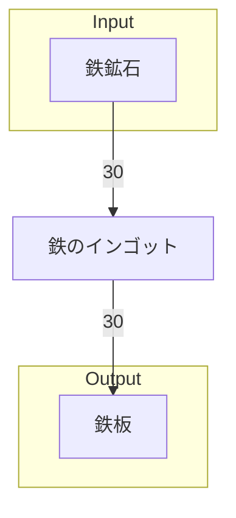

# 手順書‗全体製造ライン設計書

## 全体製造ライン設計書を記載する目的
工場内部にどのような製造ラインを設けるかを決定し、各製造ラインでやり取りされるアイテムの種類と個数を明確にする。
- どのような製造ラインを設けるか
- 各製造ラインはどれくらいのInput/Outputが必要か
- 製造ラインから搬出されたアイテムが、次にどこの製造ラインに向かうか

## フローチャート を記載する
各製造ライン同士のアイテムのやり取りを可視化する。

### 例

## 情報 を記載する
書類バージョン等の、書類の情報を記載する

## 情報
書類バージョン : 1.2.0
