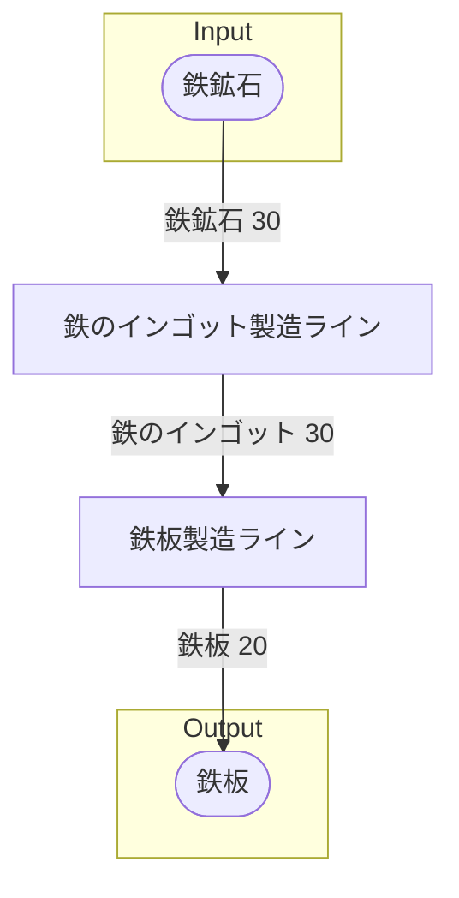

# 手順書‗全体製造ライン設計書

## 全体製造ライン設計書を記載する目的
工場内部にどのような製造ラインを設けるかを決定し、各製造ラインでやり取りされるアイテムの種類と個数を明確にする。
- 必要なレシピは何か
- 同じレシピをいくつ使えばよいか
- どのような製造ラインを設けるか
  - 各製造ラインはどれくらいのInput/Outputが必要か
- 製造ラインから搬出されたアイテムが、次にどこの製造ラインに向かうか

## 使用レシピ を記載する
製造ライン全体で使用するレシピを明記し、以後のライン設計に用いる。

### 例
### 鉄のインゴット
|Input|Output|
|---|---|
|鉄鉱石 30/m|鉄のインゴット 30/m|
### 鉄板
|Input|Output|
|---|---|
|鉄のインゴット 30/m|鉄板 20/m|

## 必要製造ライン を記載する
必要な製造ラインと、レシピの数、Input/Output合計を記載する。

### 例
### 鉄のインゴット製造ライン
|レシピ名|数|Input計|Output計|
|---|---|---|---|
|鉄のインゴット|1|鉄鉱石 30/m|鉄のインゴット 30/m|
### 鉄板製造ライン
|レシピ名|数|Input計|Output計|
|---|---|---|---|
|鉄板|1|鉄のインゴット 30/m|鉄板 20/m|

## 製造ラインフローチャート を記載する
製造ライン同士でやり取りをするアイテムを記載する

### 例

## 情報 を記載する
書類バージョン等の、書類の情報を記載する

## 情報
書類バージョン : 1.3.0
