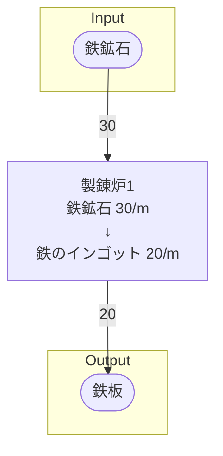

# 手順書‗個別製造ライン設計書

## 個別製造ライン設計書を記載する目的
個別の製造ラインの情報を明確にする。明確にする情報は以下の通り
- どんな設備でどんなレシピを使うのか。
- 設備の個数はどれくらいか。
- 設備全体でのInput/Outputアイテムの種類は何か、個数はどれくらいか

## 概要 を記載する
製造ラインの概要

### 例
初期一時工場の鉄鉱石から鉄のインゴットを製錬するライン

## Input を記載する
搬入するアイテムと、その1分あたりの量  
レシピのInput数 * レシピ数 で計算し、他のラインから流れてくる数量は無視して記載すること

### 例
- 鉄鉱石 30/m

## Output を記載する
搬出するアイテムと、その1分あたりの量  

### 例
- 鉄インゴット 30/m
    - 鉄板ライン行き 30/m

## 必要設備 を記載する
製造ラインの建設に必要な設備を、個数と共に明記する

### 例
- 製錬炉 1
- ベルトコンベア類 適量

## 製造ライン を記載する

## 情報 を記載する
書類バージョン等の、書類の情報を記載する

## 情報
書類テンプレートバージョン : 1.5.0
