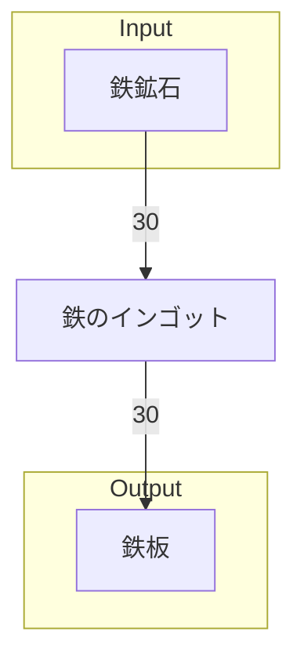

# 手順書‗概要設計

## フローチャート を記載する
各製造ライン同士のアイテムのやり取りを可視化する。

### 例

```mermaid
flowchart TD

subgraph Input
    鉄鉱石[鉄鉱石]
end

鉄のインゴット[鉄のインゴット]

subgraph Output
    鉄板[鉄板]
end


鉄鉱石-->|30|鉄のインゴット
鉄のインゴット-->|30|鉄板


```

## 情報 を記載する
書類バージョン等の、書類の情報を記載する

## 情報
書類バージョン : 1.0.0
