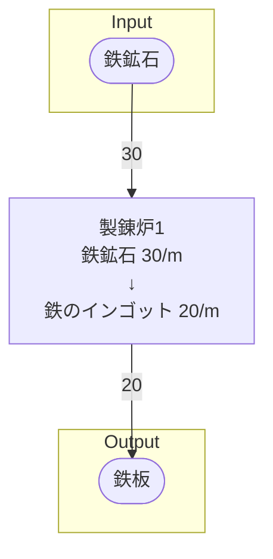

# 手順書‗詳細設計

## 概要 を記載する
製造ラインの概要

### 例
初期一時工場の鉄鉱石から鉄のインゴットを製錬するライン

## Input を記載する
搬入するアイテムと、その1分あたりの量

### 例
- 鉄鉱石 30/m

## Output を記載する
搬出するアイテムと、その1分あたりの量  
なお、どの製造ラインへ搬出するかを明記すること

### 例
- 鉄インゴット 30/m
    - 鉄板ライン行き 30/m

## 必要設備 を記載する
製造ラインの建設に必要な設備を、個数と共に明記する

### 例
- 製錬炉 1
- ベルトコンベア類 適量

## 製造ライン を記載する

## 情報 を記載する
書類バージョン等の、書類の情報を記載する

## 情報
書類バージョン : 1.0.0
