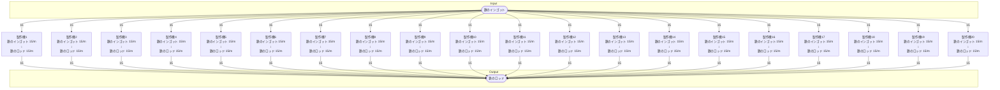

# 個別製造ライン設計書 鉄のロッド製造ライン

## 概要
以下の物品を生産する

- 鉄のロッド

## Input
- 鉄のインゴット 300/m

## Output
- 鉄のロッド 300/m

## 必要設備
- 製作機 20ケ
- ベルトコンベア類 適量

## 製造ライン

```mermaid
flowchart TD

subgraph Input
    鉄のインゴット([鉄のインゴット])
end

製作機1[
    製作機1
    鉄のインゴット 15/m
    ↓
    鉄のロッド 15/m
]

製作機2[
    製作機2
    鉄のインゴット 15/m
    ↓
    鉄のロッド 15/m
]

製作機3[
    製作機3
    鉄のインゴット 15/m
    ↓
    鉄のロッド 15/m
]

製作機4[
    製作機4
    鉄のインゴット 15/m
    ↓
    鉄のロッド 15/m
]

製作機5[
    製作機5
    鉄のインゴット 15/m
    ↓
    鉄のロッド 15/m
]

製作機6[
    製作機6
    鉄のインゴット 15/m
    ↓
    鉄のロッド 15/m
]

製作機7[
    製作機7
    鉄のインゴット 15/m
    ↓
    鉄のロッド 15/m
]

製作機8[
    製作機8
    鉄のインゴット 15/m
    ↓
    鉄のロッド 15/m
]

製作機9[
    製作機9
    鉄のインゴット 15/m
    ↓
    鉄のロッド 15/m
]

製作機10[
    製作機10
    鉄のインゴット 15/m
    ↓
    鉄のロッド 15/m
]

製作機11[
    製作機11
    鉄のインゴット 15/m
    ↓
    鉄のロッド 15/m
]

製作機12[
    製作機12
    鉄のインゴット 15/m
    ↓
    鉄のロッド 15/m
]

製作機13[
    製作機13
    鉄のインゴット 15/m
    ↓
    鉄のロッド 15/m
]

製作機14[
    製作機14
    鉄のインゴット 15/m
    ↓
    鉄のロッド 15/m
]

製作機15[
    製作機15
    鉄のインゴット 15/m
    ↓
    鉄のロッド 15/m
]

製作機16[
    製作機16
    鉄のインゴット 15/m
    ↓
    鉄のロッド 15/m
]

製作機17[
    製作機17
    鉄のインゴット 15/m
    ↓
    鉄のロッド 15/m
]

製作機18[
    製作機18
    鉄のインゴット 15/m
    ↓
    鉄のロッド 15/m
]

製作機19[
    製作機19
    鉄のインゴット 15/m
    ↓
    鉄のロッド 15/m
]

製作機20[
    製作機20
    鉄のインゴット 15/m
    ↓
    鉄のロッド 15/m
]

subgraph Output
    鉄のロッド([鉄のロッド])
end

鉄のインゴット-->|15|製作機1
製作機1-->|15|鉄のロッド
鉄のインゴット-->|15|製作機2
製作機2-->|15|鉄のロッド
鉄のインゴット-->|15|製作機3
製作機3-->|15|鉄のロッド
鉄のインゴット-->|15|製作機4
製作機4-->|15|鉄のロッド
鉄のインゴット-->|15|製作機5
製作機5-->|15|鉄のロッド
鉄のインゴット-->|15|製作機6
製作機6-->|15|鉄のロッド
鉄のインゴット-->|15|製作機7
製作機7-->|15|鉄のロッド
鉄のインゴット-->|15|製作機8
製作機8-->|15|鉄のロッド
鉄のインゴット-->|15|製作機9
製作機9-->|15|鉄のロッド
鉄のインゴット-->|15|製作機10
製作機10-->|15|鉄のロッド
鉄のインゴット-->|15|製作機11
製作機11-->|15|鉄のロッド
鉄のインゴット-->|15|製作機12
製作機12-->|15|鉄のロッド
鉄のインゴット-->|15|製作機13
製作機13-->|15|鉄のロッド
鉄のインゴット-->|15|製作機14
製作機14-->|15|鉄のロッド
鉄のインゴット-->|15|製作機15
製作機15-->|15|鉄のロッド
鉄のインゴット-->|15|製作機16
製作機16-->|15|鉄のロッド
鉄のインゴット-->|15|製作機17
製作機17-->|15|鉄のロッド
鉄のインゴット-->|15|製作機18
製作機18-->|15|鉄のロッド
鉄のインゴット-->|15|製作機19
製作機19-->|15|鉄のロッド
鉄のインゴット-->|15|製作機20
製作機20-->|15|鉄のロッド
```

## 情報
書類テンプレートバージョン : 1.5.0
