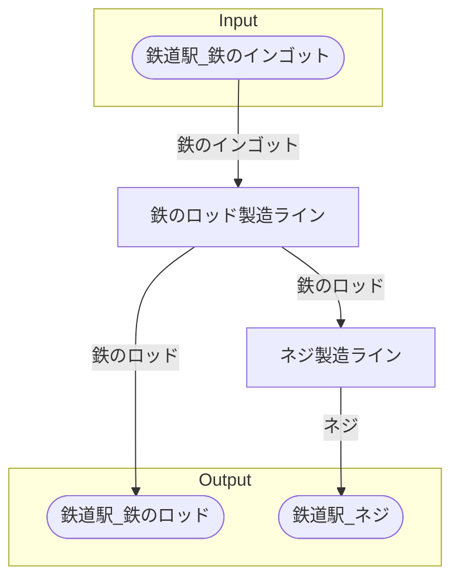

# アテネネジ工場 全体製造ライン設計書

## 使用レシピ
### 鉄のロッド
|I/O|物品名|要求数|
|---|---|---|
|input|鉄のインゴット|15|
|---|---|---|
|output|鉄のロッド|15|
### ネジ
|I/O|物品名|要求数|
|---|---|---|
|input|鉄のロッド|10|
|---|---|---|
|output|ネジ|40|

## 必要製造ライン
### 鉄のロッド製造ライン

レシピ名 : 鉄のロッド  
レシピ数 : 20

|I/O|物品名|要求数|
|---|---|---|
|input|鉄のインゴット|300|
|---|---|---|
|output|鉄のロッド|300|

### ネジ製造ライン

レシピ名 : ネジ  
レシピ数 : 50

|I/O|物品名|要求数|
|---|---|---|
|input|鉄のロッド|500|
|---|---|---|
|output|ネジ|2000|

## 製造ラインフローチャート

## 情報
書類テンプレートバージョン : 1.7.0
