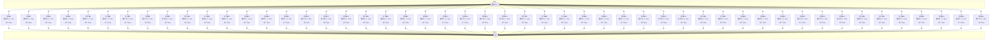

# 個別製造ライン設計書 ネジ製造ライン

## 概要
以下の物品を生産する

- ネジ

## Input
- 鉄のロッド 500/m

## Output
- ネジ 2000/m

## 必要設備
- 製作機 50ケ
- ベルトコンベア類 適量

## 製造ライン

```mermaid
flowchart TD

subgraph Input
    鉄のロッド([鉄のロッド])
end

製作機1[
    製作機1
    鉄のロッド 10/m
    ↓
    ネジ 40/m
]

製作機2[
    製作機2
    鉄のロッド 10/m
    ↓
    ネジ 40/m
]

製作機3[
    製作機3
    鉄のロッド 10/m
    ↓
    ネジ 40/m
]

製作機4[
    製作機4
    鉄のロッド 10/m
    ↓
    ネジ 40/m
]

製作機5[
    製作機5
    鉄のロッド 10/m
    ↓
    ネジ 40/m
]

製作機6[
    製作機6
    鉄のロッド 10/m
    ↓
    ネジ 40/m
]

製作機7[
    製作機7
    鉄のロッド 10/m
    ↓
    ネジ 40/m
]

製作機8[
    製作機8
    鉄のロッド 10/m
    ↓
    ネジ 40/m
]

製作機9[
    製作機9
    鉄のロッド 10/m
    ↓
    ネジ 40/m
]

製作機10[
    製作機10
    鉄のロッド 10/m
    ↓
    ネジ 40/m
]

製作機11[
    製作機11
    鉄のロッド 10/m
    ↓
    ネジ 40/m
]

製作機12[
    製作機12
    鉄のロッド 10/m
    ↓
    ネジ 40/m
]

製作機13[
    製作機13
    鉄のロッド 10/m
    ↓
    ネジ 40/m
]

製作機14[
    製作機14
    鉄のロッド 10/m
    ↓
    ネジ 40/m
]

製作機15[
    製作機15
    鉄のロッド 10/m
    ↓
    ネジ 40/m
]

製作機16[
    製作機16
    鉄のロッド 10/m
    ↓
    ネジ 40/m
]

製作機17[
    製作機17
    鉄のロッド 10/m
    ↓
    ネジ 40/m
]

製作機18[
    製作機18
    鉄のロッド 10/m
    ↓
    ネジ 40/m
]

製作機19[
    製作機19
    鉄のロッド 10/m
    ↓
    ネジ 40/m
]

製作機20[
    製作機20
    鉄のロッド 10/m
    ↓
    ネジ 40/m
]

製作機21[
    製作機21
    鉄のロッド 10/m
    ↓
    ネジ 40/m
]

製作機22[
    製作機22
    鉄のロッド 10/m
    ↓
    ネジ 40/m
]

製作機23[
    製作機23
    鉄のロッド 10/m
    ↓
    ネジ 40/m
]

製作機24[
    製作機24
    鉄のロッド 10/m
    ↓
    ネジ 40/m
]

製作機25[
    製作機25
    鉄のロッド 10/m
    ↓
    ネジ 40/m
]

製作機26[
    製作機26
    鉄のロッド 10/m
    ↓
    ネジ 40/m
]

製作機27[
    製作機27
    鉄のロッド 10/m
    ↓
    ネジ 40/m
]

製作機28[
    製作機28
    鉄のロッド 10/m
    ↓
    ネジ 40/m
]

製作機29[
    製作機29
    鉄のロッド 10/m
    ↓
    ネジ 40/m
]

製作機30[
    製作機30
    鉄のロッド 10/m
    ↓
    ネジ 40/m
]

製作機31[
    製作機31
    鉄のロッド 10/m
    ↓
    ネジ 40/m
]

製作機32[
    製作機32
    鉄のロッド 10/m
    ↓
    ネジ 40/m
]

製作機33[
    製作機33
    鉄のロッド 10/m
    ↓
    ネジ 40/m
]

製作機34[
    製作機34
    鉄のロッド 10/m
    ↓
    ネジ 40/m
]

製作機35[
    製作機35
    鉄のロッド 10/m
    ↓
    ネジ 40/m
]

製作機36[
    製作機36
    鉄のロッド 10/m
    ↓
    ネジ 40/m
]

製作機37[
    製作機37
    鉄のロッド 10/m
    ↓
    ネジ 40/m
]

製作機38[
    製作機38
    鉄のロッド 10/m
    ↓
    ネジ 40/m
]

製作機39[
    製作機39
    鉄のロッド 10/m
    ↓
    ネジ 40/m
]

製作機40[
    製作機40
    鉄のロッド 10/m
    ↓
    ネジ 40/m
]

製作機41[
    製作機41
    鉄のロッド 10/m
    ↓
    ネジ 40/m
]

製作機42[
    製作機42
    鉄のロッド 10/m
    ↓
    ネジ 40/m
]

製作機43[
    製作機43
    鉄のロッド 10/m
    ↓
    ネジ 40/m
]

製作機44[
    製作機44
    鉄のロッド 10/m
    ↓
    ネジ 40/m
]

製作機45[
    製作機45
    鉄のロッド 10/m
    ↓
    ネジ 40/m
]

製作機46[
    製作機46
    鉄のロッド 10/m
    ↓
    ネジ 40/m
]

製作機47[
    製作機47
    鉄のロッド 10/m
    ↓
    ネジ 40/m
]

製作機48[
    製作機48
    鉄のロッド 10/m
    ↓
    ネジ 40/m
]

製作機49[
    製作機49
    鉄のロッド 10/m
    ↓
    ネジ 40/m
]

製作機50[
    製作機50
    鉄のロッド 10/m
    ↓
    ネジ 40/m
]

subgraph Output
    ネジ([ネジ])
end

鉄のロッド-->|10|製作機1
製作機1-->|40|ネジ
鉄のロッド-->|10|製作機2
製作機2-->|40|ネジ
鉄のロッド-->|10|製作機3
製作機3-->|40|ネジ
鉄のロッド-->|10|製作機4
製作機4-->|40|ネジ
鉄のロッド-->|10|製作機5
製作機5-->|40|ネジ
鉄のロッド-->|10|製作機6
製作機6-->|40|ネジ
鉄のロッド-->|10|製作機7
製作機7-->|40|ネジ
鉄のロッド-->|10|製作機8
製作機8-->|40|ネジ
鉄のロッド-->|10|製作機9
製作機9-->|40|ネジ
鉄のロッド-->|10|製作機10
製作機10-->|40|ネジ
鉄のロッド-->|10|製作機11
製作機11-->|40|ネジ
鉄のロッド-->|10|製作機12
製作機12-->|40|ネジ
鉄のロッド-->|10|製作機13
製作機13-->|40|ネジ
鉄のロッド-->|10|製作機14
製作機14-->|40|ネジ
鉄のロッド-->|10|製作機15
製作機15-->|40|ネジ
鉄のロッド-->|10|製作機16
製作機16-->|40|ネジ
鉄のロッド-->|10|製作機17
製作機17-->|40|ネジ
鉄のロッド-->|10|製作機18
製作機18-->|40|ネジ
鉄のロッド-->|10|製作機19
製作機19-->|40|ネジ
鉄のロッド-->|10|製作機20
製作機20-->|40|ネジ
鉄のロッド-->|10|製作機21
製作機21-->|40|ネジ
鉄のロッド-->|10|製作機22
製作機22-->|40|ネジ
鉄のロッド-->|10|製作機23
製作機23-->|40|ネジ
鉄のロッド-->|10|製作機24
製作機24-->|40|ネジ
鉄のロッド-->|10|製作機25
製作機25-->|40|ネジ
鉄のロッド-->|10|製作機26
製作機26-->|40|ネジ
鉄のロッド-->|10|製作機27
製作機27-->|40|ネジ
鉄のロッド-->|10|製作機28
製作機28-->|40|ネジ
鉄のロッド-->|10|製作機29
製作機29-->|40|ネジ
鉄のロッド-->|10|製作機30
製作機30-->|40|ネジ
鉄のロッド-->|10|製作機31
製作機31-->|40|ネジ
鉄のロッド-->|10|製作機32
製作機32-->|40|ネジ
鉄のロッド-->|10|製作機33
製作機33-->|40|ネジ
鉄のロッド-->|10|製作機34
製作機34-->|40|ネジ
鉄のロッド-->|10|製作機35
製作機35-->|40|ネジ
鉄のロッド-->|10|製作機36
製作機36-->|40|ネジ
鉄のロッド-->|10|製作機37
製作機37-->|40|ネジ
鉄のロッド-->|10|製作機38
製作機38-->|40|ネジ
鉄のロッド-->|10|製作機39
製作機39-->|40|ネジ
鉄のロッド-->|10|製作機40
製作機40-->|40|ネジ
鉄のロッド-->|10|製作機41
製作機41-->|40|ネジ
鉄のロッド-->|10|製作機42
製作機42-->|40|ネジ
鉄のロッド-->|10|製作機43
製作機43-->|40|ネジ
鉄のロッド-->|10|製作機44
製作機44-->|40|ネジ
鉄のロッド-->|10|製作機45
製作機45-->|40|ネジ
鉄のロッド-->|10|製作機46
製作機46-->|40|ネジ
鉄のロッド-->|10|製作機47
製作機47-->|40|ネジ
鉄のロッド-->|10|製作機48
製作機48-->|40|ネジ
鉄のロッド-->|10|製作機49
製作機49-->|40|ネジ
鉄のロッド-->|10|製作機50
製作機50-->|40|ネジ
```

## 情報
書類テンプレートバージョン : 1.5.0
