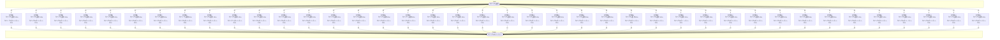

# 個別製造ライン設計書 カテリウムのインゴット製造ライン

## 概要
以下の物品を生産する

- カテリウムのインゴット

## Input
- カテリウム鉱石 1800/m

## Output
- カテリウムのインゴット 600/m

## 必要設備
- 製作機 40ケ
- ベルトコンベア類 適量

## 製造ライン

```mermaid
flowchart TD

subgraph Input
    カテリウム鉱石([カテリウム鉱石])
end

製作機1[
    製作機1
    カテリウム鉱石 45/m
    ↓
    カテリウムのインゴット 15/m
]

製作機2[
    製作機2
    カテリウム鉱石 45/m
    ↓
    カテリウムのインゴット 15/m
]

製作機3[
    製作機3
    カテリウム鉱石 45/m
    ↓
    カテリウムのインゴット 15/m
]

製作機4[
    製作機4
    カテリウム鉱石 45/m
    ↓
    カテリウムのインゴット 15/m
]

製作機5[
    製作機5
    カテリウム鉱石 45/m
    ↓
    カテリウムのインゴット 15/m
]

製作機6[
    製作機6
    カテリウム鉱石 45/m
    ↓
    カテリウムのインゴット 15/m
]

製作機7[
    製作機7
    カテリウム鉱石 45/m
    ↓
    カテリウムのインゴット 15/m
]

製作機8[
    製作機8
    カテリウム鉱石 45/m
    ↓
    カテリウムのインゴット 15/m
]

製作機9[
    製作機9
    カテリウム鉱石 45/m
    ↓
    カテリウムのインゴット 15/m
]

製作機10[
    製作機10
    カテリウム鉱石 45/m
    ↓
    カテリウムのインゴット 15/m
]

製作機11[
    製作機11
    カテリウム鉱石 45/m
    ↓
    カテリウムのインゴット 15/m
]

製作機12[
    製作機12
    カテリウム鉱石 45/m
    ↓
    カテリウムのインゴット 15/m
]

製作機13[
    製作機13
    カテリウム鉱石 45/m
    ↓
    カテリウムのインゴット 15/m
]

製作機14[
    製作機14
    カテリウム鉱石 45/m
    ↓
    カテリウムのインゴット 15/m
]

製作機15[
    製作機15
    カテリウム鉱石 45/m
    ↓
    カテリウムのインゴット 15/m
]

製作機16[
    製作機16
    カテリウム鉱石 45/m
    ↓
    カテリウムのインゴット 15/m
]

製作機17[
    製作機17
    カテリウム鉱石 45/m
    ↓
    カテリウムのインゴット 15/m
]

製作機18[
    製作機18
    カテリウム鉱石 45/m
    ↓
    カテリウムのインゴット 15/m
]

製作機19[
    製作機19
    カテリウム鉱石 45/m
    ↓
    カテリウムのインゴット 15/m
]

製作機20[
    製作機20
    カテリウム鉱石 45/m
    ↓
    カテリウムのインゴット 15/m
]

製作機21[
    製作機21
    カテリウム鉱石 45/m
    ↓
    カテリウムのインゴット 15/m
]

製作機22[
    製作機22
    カテリウム鉱石 45/m
    ↓
    カテリウムのインゴット 15/m
]

製作機23[
    製作機23
    カテリウム鉱石 45/m
    ↓
    カテリウムのインゴット 15/m
]

製作機24[
    製作機24
    カテリウム鉱石 45/m
    ↓
    カテリウムのインゴット 15/m
]

製作機25[
    製作機25
    カテリウム鉱石 45/m
    ↓
    カテリウムのインゴット 15/m
]

製作機26[
    製作機26
    カテリウム鉱石 45/m
    ↓
    カテリウムのインゴット 15/m
]

製作機27[
    製作機27
    カテリウム鉱石 45/m
    ↓
    カテリウムのインゴット 15/m
]

製作機28[
    製作機28
    カテリウム鉱石 45/m
    ↓
    カテリウムのインゴット 15/m
]

製作機29[
    製作機29
    カテリウム鉱石 45/m
    ↓
    カテリウムのインゴット 15/m
]

製作機30[
    製作機30
    カテリウム鉱石 45/m
    ↓
    カテリウムのインゴット 15/m
]

製作機31[
    製作機31
    カテリウム鉱石 45/m
    ↓
    カテリウムのインゴット 15/m
]

製作機32[
    製作機32
    カテリウム鉱石 45/m
    ↓
    カテリウムのインゴット 15/m
]

製作機33[
    製作機33
    カテリウム鉱石 45/m
    ↓
    カテリウムのインゴット 15/m
]

製作機34[
    製作機34
    カテリウム鉱石 45/m
    ↓
    カテリウムのインゴット 15/m
]

製作機35[
    製作機35
    カテリウム鉱石 45/m
    ↓
    カテリウムのインゴット 15/m
]

製作機36[
    製作機36
    カテリウム鉱石 45/m
    ↓
    カテリウムのインゴット 15/m
]

製作機37[
    製作機37
    カテリウム鉱石 45/m
    ↓
    カテリウムのインゴット 15/m
]

製作機38[
    製作機38
    カテリウム鉱石 45/m
    ↓
    カテリウムのインゴット 15/m
]

製作機39[
    製作機39
    カテリウム鉱石 45/m
    ↓
    カテリウムのインゴット 15/m
]

製作機40[
    製作機40
    カテリウム鉱石 45/m
    ↓
    カテリウムのインゴット 15/m
]

subgraph Output
    カテリウムのインゴット([カテリウムのインゴット])
end

カテリウム鉱石-->|45|製作機1
製作機1-->|15|カテリウムのインゴット
カテリウム鉱石-->|45|製作機2
製作機2-->|15|カテリウムのインゴット
カテリウム鉱石-->|45|製作機3
製作機3-->|15|カテリウムのインゴット
カテリウム鉱石-->|45|製作機4
製作機4-->|15|カテリウムのインゴット
カテリウム鉱石-->|45|製作機5
製作機5-->|15|カテリウムのインゴット
カテリウム鉱石-->|45|製作機6
製作機6-->|15|カテリウムのインゴット
カテリウム鉱石-->|45|製作機7
製作機7-->|15|カテリウムのインゴット
カテリウム鉱石-->|45|製作機8
製作機8-->|15|カテリウムのインゴット
カテリウム鉱石-->|45|製作機9
製作機9-->|15|カテリウムのインゴット
カテリウム鉱石-->|45|製作機10
製作機10-->|15|カテリウムのインゴット
カテリウム鉱石-->|45|製作機11
製作機11-->|15|カテリウムのインゴット
カテリウム鉱石-->|45|製作機12
製作機12-->|15|カテリウムのインゴット
カテリウム鉱石-->|45|製作機13
製作機13-->|15|カテリウムのインゴット
カテリウム鉱石-->|45|製作機14
製作機14-->|15|カテリウムのインゴット
カテリウム鉱石-->|45|製作機15
製作機15-->|15|カテリウムのインゴット
カテリウム鉱石-->|45|製作機16
製作機16-->|15|カテリウムのインゴット
カテリウム鉱石-->|45|製作機17
製作機17-->|15|カテリウムのインゴット
カテリウム鉱石-->|45|製作機18
製作機18-->|15|カテリウムのインゴット
カテリウム鉱石-->|45|製作機19
製作機19-->|15|カテリウムのインゴット
カテリウム鉱石-->|45|製作機20
製作機20-->|15|カテリウムのインゴット
カテリウム鉱石-->|45|製作機21
製作機21-->|15|カテリウムのインゴット
カテリウム鉱石-->|45|製作機22
製作機22-->|15|カテリウムのインゴット
カテリウム鉱石-->|45|製作機23
製作機23-->|15|カテリウムのインゴット
カテリウム鉱石-->|45|製作機24
製作機24-->|15|カテリウムのインゴット
カテリウム鉱石-->|45|製作機25
製作機25-->|15|カテリウムのインゴット
カテリウム鉱石-->|45|製作機26
製作機26-->|15|カテリウムのインゴット
カテリウム鉱石-->|45|製作機27
製作機27-->|15|カテリウムのインゴット
カテリウム鉱石-->|45|製作機28
製作機28-->|15|カテリウムのインゴット
カテリウム鉱石-->|45|製作機29
製作機29-->|15|カテリウムのインゴット
カテリウム鉱石-->|45|製作機30
製作機30-->|15|カテリウムのインゴット
カテリウム鉱石-->|45|製作機31
製作機31-->|15|カテリウムのインゴット
カテリウム鉱石-->|45|製作機32
製作機32-->|15|カテリウムのインゴット
カテリウム鉱石-->|45|製作機33
製作機33-->|15|カテリウムのインゴット
カテリウム鉱石-->|45|製作機34
製作機34-->|15|カテリウムのインゴット
カテリウム鉱石-->|45|製作機35
製作機35-->|15|カテリウムのインゴット
カテリウム鉱石-->|45|製作機36
製作機36-->|15|カテリウムのインゴット
カテリウム鉱石-->|45|製作機37
製作機37-->|15|カテリウムのインゴット
カテリウム鉱石-->|45|製作機38
製作機38-->|15|カテリウムのインゴット
カテリウム鉱石-->|45|製作機39
製作機39-->|15|カテリウムのインゴット
カテリウム鉱石-->|45|製作機40
製作機40-->|15|カテリウムのインゴット
```

## 情報
書類テンプレートバージョン : 1.5.0
