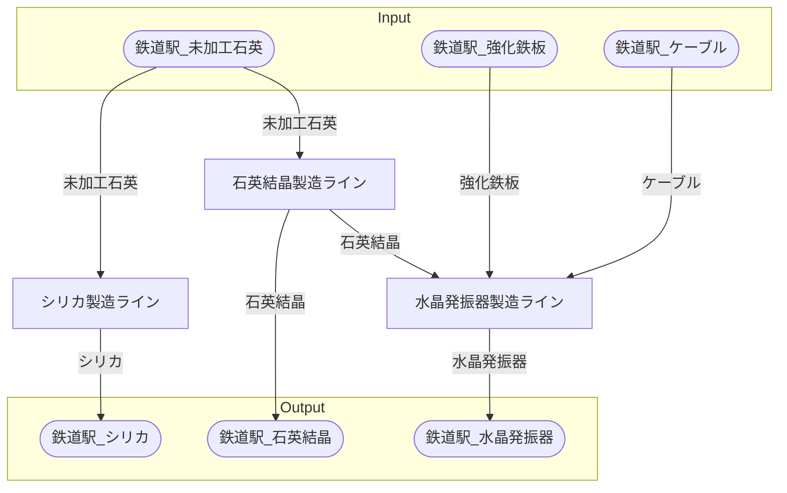

# キャンベラ石英加工場 全体製造ライン設計書

## 使用レシピ
### シリカ
|I/O|物品名|要求数|
|---|---|---|
|input|未加工石英|22.5|
|---|---|---|
|output|シリカ|37.5|
### 石英結晶
|I/O|物品名|要求数|
|---|---|---|
|input|未加工石英|37.5|
|---|---|---|
|output|石英結晶|22.5|
### 水晶発振器
|I/O|物品名|要求数|
|---|---|---|
|input|石英結晶|18|
|input|ケーブル|14|
|input|強化鉄板|2.5|
|---|---|---|
|output|水晶発振器|1|

## 必要製造ライン
### シリカ製造ライン

レシピ名 : シリカ  
レシピ数 : 10

|I/O|物品名|要求数|
|---|---|---|
|input|未加工石英|225.0|
|---|---|---|
|output|シリカ|375.0|

### 石英結晶製造ライン

レシピ名 : 石英結晶  
レシピ数 : 10

|I/O|物品名|要求数|
|---|---|---|
|input|未加工石英|375.0|
|---|---|---|
|output|石英結晶|225.0|

### 水晶発振器製造ライン

レシピ名 : 水晶発振器  
レシピ数 : 4

|I/O|物品名|要求数|
|---|---|---|
|input|石英結晶|72|
|input|ケーブル|56|
|input|強化鉄板|10.0|
|---|---|---|
|output|水晶発振器|4|

## 製造ラインフローチャート

## 情報
書類テンプレートバージョン : 1.7.0
