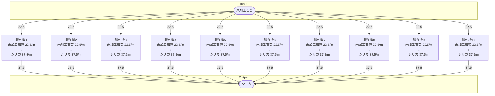

# 個別製造ライン設計書 シリカ製造ライン

## 概要
以下の物品を生産する

- シリカ

## Input
- 未加工石英 225.0/m

## Output
- シリカ 375.0/m

## 必要設備
- 製作機 10ケ
- ベルトコンベア類 適量

## 製造ライン

```mermaid
flowchart TD

subgraph Input
    未加工石英([未加工石英])
end

製作機1[
    製作機1
    未加工石英 22.5/m
    ↓
    シリカ 37.5/m
]

製作機2[
    製作機2
    未加工石英 22.5/m
    ↓
    シリカ 37.5/m
]

製作機3[
    製作機3
    未加工石英 22.5/m
    ↓
    シリカ 37.5/m
]

製作機4[
    製作機4
    未加工石英 22.5/m
    ↓
    シリカ 37.5/m
]

製作機5[
    製作機5
    未加工石英 22.5/m
    ↓
    シリカ 37.5/m
]

製作機6[
    製作機6
    未加工石英 22.5/m
    ↓
    シリカ 37.5/m
]

製作機7[
    製作機7
    未加工石英 22.5/m
    ↓
    シリカ 37.5/m
]

製作機8[
    製作機8
    未加工石英 22.5/m
    ↓
    シリカ 37.5/m
]

製作機9[
    製作機9
    未加工石英 22.5/m
    ↓
    シリカ 37.5/m
]

製作機10[
    製作機10
    未加工石英 22.5/m
    ↓
    シリカ 37.5/m
]

subgraph Output
    シリカ([シリカ])
end

未加工石英-->|22.5|製作機1
製作機1-->|37.5|シリカ
未加工石英-->|22.5|製作機2
製作機2-->|37.5|シリカ
未加工石英-->|22.5|製作機3
製作機3-->|37.5|シリカ
未加工石英-->|22.5|製作機4
製作機4-->|37.5|シリカ
未加工石英-->|22.5|製作機5
製作機5-->|37.5|シリカ
未加工石英-->|22.5|製作機6
製作機6-->|37.5|シリカ
未加工石英-->|22.5|製作機7
製作機7-->|37.5|シリカ
未加工石英-->|22.5|製作機8
製作機8-->|37.5|シリカ
未加工石英-->|22.5|製作機9
製作機9-->|37.5|シリカ
未加工石英-->|22.5|製作機10
製作機10-->|37.5|シリカ
```

## 情報
書類テンプレートバージョン : 1.5.0
