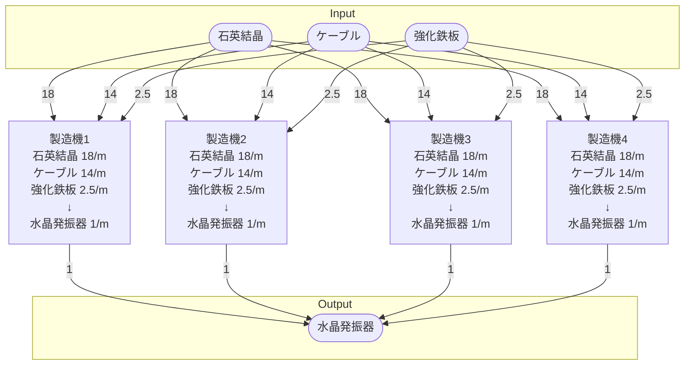

# 個別製造ライン設計書 水晶発振器製造ライン

## 概要
以下の物品を生産する

- 水晶発振器

## Input
- 石英結晶 72/m
- ケーブル 56/m
- 強化鉄板 10.0/m

## Output
- 水晶発振器 4/m

## 必要設備
- 製造機 4ケ
- ベルトコンベア類 適量

## 製造ライン

```mermaid
flowchart TD

subgraph Input
    石英結晶([石英結晶])
    ケーブル([ケーブル])
    強化鉄板([強化鉄板])
end

製造機1[
    製造機1
    石英結晶 18/m
    ケーブル 14/m
    強化鉄板 2.5/m
    ↓
    水晶発振器 1/m
]

製造機2[
    製造機2
    石英結晶 18/m
    ケーブル 14/m
    強化鉄板 2.5/m
    ↓
    水晶発振器 1/m
]

製造機3[
    製造機3
    石英結晶 18/m
    ケーブル 14/m
    強化鉄板 2.5/m
    ↓
    水晶発振器 1/m
]

製造機4[
    製造機4
    石英結晶 18/m
    ケーブル 14/m
    強化鉄板 2.5/m
    ↓
    水晶発振器 1/m
]

subgraph Output
    水晶発振器([水晶発振器])
end

石英結晶-->|18|製造機1
ケーブル-->|14|製造機1
強化鉄板-->|2.5|製造機1
製造機1-->|1|水晶発振器
石英結晶-->|18|製造機2
ケーブル-->|14|製造機2
強化鉄板-->|2.5|製造機2
製造機2-->|1|水晶発振器
石英結晶-->|18|製造機3
ケーブル-->|14|製造機3
強化鉄板-->|2.5|製造機3
製造機3-->|1|水晶発振器
石英結晶-->|18|製造機4
ケーブル-->|14|製造機4
強化鉄板-->|2.5|製造機4
製造機4-->|1|水晶発振器
```

## 情報
書類テンプレートバージョン : 1.5.0
