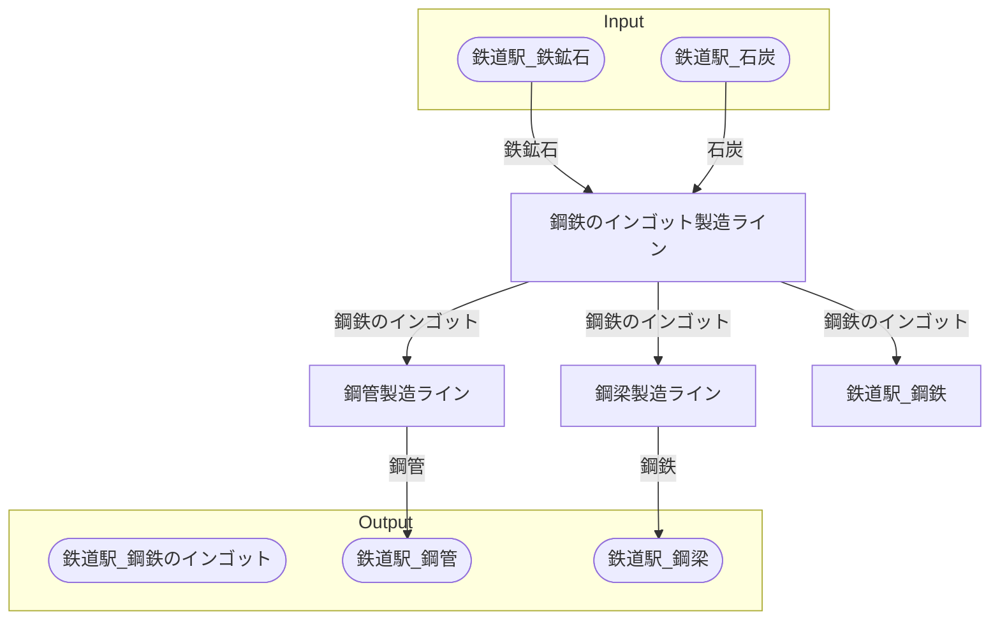

# キルナ鋼鉄工場 全体製造ライン設計書

## 使用レシピ
### 鋼鉄のインゴット
|I/O|物品名|要求数|
|---|---|---|
|input|鉄鉱石|45|
|input|石炭|45|
|---|---|---|
|output|鋼鉄のインゴット|45|
### 鋼管
|I/O|物品名|要求数|
|---|---|---|
|input|鋼鉄のインゴット|30|
|---|---|---|
|output|鋼管|20|
### 鋼梁
|I/O|物品名|要求数|
|---|---|---|
|input|鋼鉄のインゴット|60|
|---|---|---|
|output|鋼梁|15|

## 必要製造ライン
### 鋼鉄のインゴット製造ライン

レシピ名 : 鋼鉄のインゴット  
レシピ数 : 16

|I/O|物品名|要求数|
|---|---|---|
|input|鉄鉱石|720|
|input|石炭|720|
|---|---|---|
|output|鋼鉄のインゴット|720|

### 鋼管製造ライン

レシピ名 : 鋼管  
レシピ数 : 20

|I/O|物品名|要求数|
|---|---|---|
|input|鋼鉄のインゴット|600|
|---|---|---|
|output|鋼管|400|

### 鋼梁製造ライン

レシピ名 : 鋼梁  
レシピ数 : 20

|I/O|物品名|要求数|
|---|---|---|
|input|鋼鉄のインゴット|1200|
|---|---|---|
|output|鋼梁|300|

## 製造ラインフローチャート

## 情報
書類テンプレートバージョン : 1.7.0
