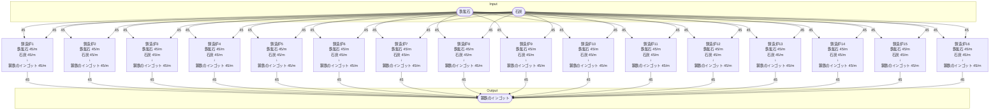

# 個別製造ライン設計書 鋼鉄のインゴット製造ライン

## 概要
以下の物品を生産する

- 鋼鉄のインゴット

## Input
- 鉄鉱石 720/m
- 石炭 720/m

## Output
- 鋼鉄のインゴット 720/m

## 必要設備
- 鋳造炉 16ケ
- ベルトコンベア類 適量

## 製造ライン

```mermaid
flowchart TD

subgraph Input
    鉄鉱石([鉄鉱石])
    石炭([石炭])
end

鋳造炉1[
    鋳造炉1
    鉄鉱石 45/m
    石炭 45/m
    ↓
    鋼鉄のインゴット 45/m
]

鋳造炉2[
    鋳造炉2
    鉄鉱石 45/m
    石炭 45/m
    ↓
    鋼鉄のインゴット 45/m
]

鋳造炉3[
    鋳造炉3
    鉄鉱石 45/m
    石炭 45/m
    ↓
    鋼鉄のインゴット 45/m
]

鋳造炉4[
    鋳造炉4
    鉄鉱石 45/m
    石炭 45/m
    ↓
    鋼鉄のインゴット 45/m
]

鋳造炉5[
    鋳造炉5
    鉄鉱石 45/m
    石炭 45/m
    ↓
    鋼鉄のインゴット 45/m
]

鋳造炉6[
    鋳造炉6
    鉄鉱石 45/m
    石炭 45/m
    ↓
    鋼鉄のインゴット 45/m
]

鋳造炉7[
    鋳造炉7
    鉄鉱石 45/m
    石炭 45/m
    ↓
    鋼鉄のインゴット 45/m
]

鋳造炉8[
    鋳造炉8
    鉄鉱石 45/m
    石炭 45/m
    ↓
    鋼鉄のインゴット 45/m
]

鋳造炉9[
    鋳造炉9
    鉄鉱石 45/m
    石炭 45/m
    ↓
    鋼鉄のインゴット 45/m
]

鋳造炉10[
    鋳造炉10
    鉄鉱石 45/m
    石炭 45/m
    ↓
    鋼鉄のインゴット 45/m
]

鋳造炉11[
    鋳造炉11
    鉄鉱石 45/m
    石炭 45/m
    ↓
    鋼鉄のインゴット 45/m
]

鋳造炉12[
    鋳造炉12
    鉄鉱石 45/m
    石炭 45/m
    ↓
    鋼鉄のインゴット 45/m
]

鋳造炉13[
    鋳造炉13
    鉄鉱石 45/m
    石炭 45/m
    ↓
    鋼鉄のインゴット 45/m
]

鋳造炉14[
    鋳造炉14
    鉄鉱石 45/m
    石炭 45/m
    ↓
    鋼鉄のインゴット 45/m
]

鋳造炉15[
    鋳造炉15
    鉄鉱石 45/m
    石炭 45/m
    ↓
    鋼鉄のインゴット 45/m
]

鋳造炉16[
    鋳造炉16
    鉄鉱石 45/m
    石炭 45/m
    ↓
    鋼鉄のインゴット 45/m
]

subgraph Output
    鋼鉄のインゴット([鋼鉄のインゴット])
end

鉄鉱石-->|45|鋳造炉1
石炭-->|45|鋳造炉1
鋳造炉1-->|45|鋼鉄のインゴット
鉄鉱石-->|45|鋳造炉2
石炭-->|45|鋳造炉2
鋳造炉2-->|45|鋼鉄のインゴット
鉄鉱石-->|45|鋳造炉3
石炭-->|45|鋳造炉3
鋳造炉3-->|45|鋼鉄のインゴット
鉄鉱石-->|45|鋳造炉4
石炭-->|45|鋳造炉4
鋳造炉4-->|45|鋼鉄のインゴット
鉄鉱石-->|45|鋳造炉5
石炭-->|45|鋳造炉5
鋳造炉5-->|45|鋼鉄のインゴット
鉄鉱石-->|45|鋳造炉6
石炭-->|45|鋳造炉6
鋳造炉6-->|45|鋼鉄のインゴット
鉄鉱石-->|45|鋳造炉7
石炭-->|45|鋳造炉7
鋳造炉7-->|45|鋼鉄のインゴット
鉄鉱石-->|45|鋳造炉8
石炭-->|45|鋳造炉8
鋳造炉8-->|45|鋼鉄のインゴット
鉄鉱石-->|45|鋳造炉9
石炭-->|45|鋳造炉9
鋳造炉9-->|45|鋼鉄のインゴット
鉄鉱石-->|45|鋳造炉10
石炭-->|45|鋳造炉10
鋳造炉10-->|45|鋼鉄のインゴット
鉄鉱石-->|45|鋳造炉11
石炭-->|45|鋳造炉11
鋳造炉11-->|45|鋼鉄のインゴット
鉄鉱石-->|45|鋳造炉12
石炭-->|45|鋳造炉12
鋳造炉12-->|45|鋼鉄のインゴット
鉄鉱石-->|45|鋳造炉13
石炭-->|45|鋳造炉13
鋳造炉13-->|45|鋼鉄のインゴット
鉄鉱石-->|45|鋳造炉14
石炭-->|45|鋳造炉14
鋳造炉14-->|45|鋼鉄のインゴット
鉄鉱石-->|45|鋳造炉15
石炭-->|45|鋳造炉15
鋳造炉15-->|45|鋼鉄のインゴット
鉄鉱石-->|45|鋳造炉16
石炭-->|45|鋳造炉16
鋳造炉16-->|45|鋼鉄のインゴット
```

## 情報
書類テンプレートバージョン : 1.5.0
