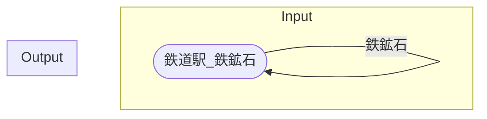

# キール鉄鉱石保管場 全体製造ライン設計書

## 資源
|資源名|産出量|
|---|---|
|鉄鉱石|540|

## 製造ラインフローチャート

```mermaid
flowchart TD
subgraph Input
    鉄道駅_鉄鉱石([鉄道駅_鉄鉱石])
end

subgraph Output
    鉄道駅_鉄鉱石([鉄道駅_鉄鉱石])
end

鉄道駅_鉄鉱石-->|鉄鉱石|鉄道駅_鉄鉱石
```

## 情報
書類テンプレートバージョン : 1.7.0
