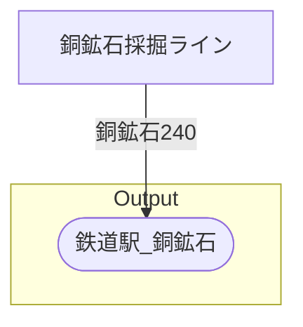

# クラスノヤルスク銅鉱石採掘場 全体製造ライン設計書

## 資源
|資源名|産出量|
|---|---|
|銅鉱石|480|

## 製造ラインフローチャート

```mermaid
flowchart TD
subgraph Output
    鉄道駅_銅鉱石([鉄道駅_銅鉱石])
end

銅鉱石採掘ライン-->|銅鉱石240|鉄道駅_銅鉱石
```

## 情報
書類テンプレートバージョン : 1.7.0
