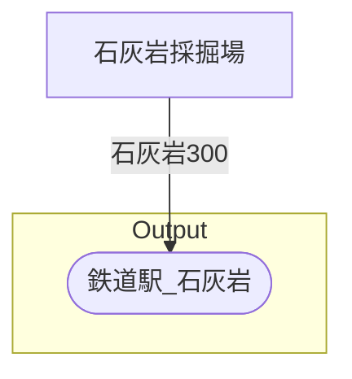

# シェブデ製油所 全体製造ライン設計書

## 資源
|資源名|産出量|
|---|---|
|石灰岩|300.0|

## 製造ラインフローチャート

```mermaid
flowchart TD
subgraph Output
    鉄道駅_石灰岩([鉄道駅_石灰岩])
end

石灰岩採掘場-->|石灰岩300|鉄道駅_石灰岩
```

## 情報
書類テンプレートバージョン : 1.7.0
