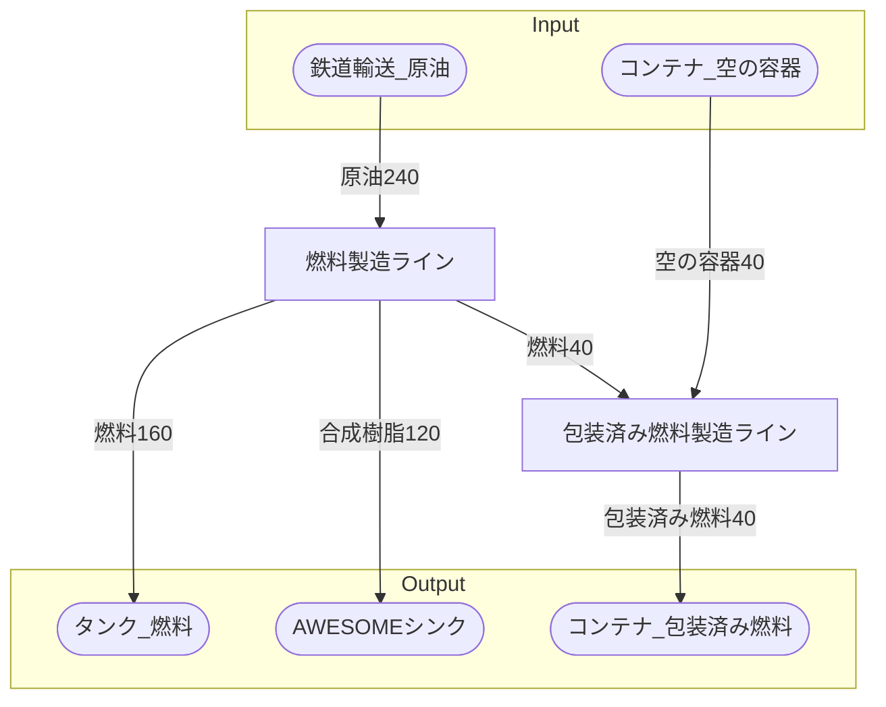

# シェブデ製油所 全体製造ライン設計書

## 使用レシピ

### 燃料
|I/O|物品名|要求数|
|---|---|---|
|input|原油|60|
|---|---|---|
|output|燃料|40|
|output|合成樹脂|30|
### 包装済み燃料
|I/O|物品名|要求数|
|---|---|---|
|input|燃料|40|
|input|空の容器|40|
|---|---|---|
|output|包装済み燃料|40|

## 必要製造ライン
### 燃料製造ライン

レシピ名 : 燃料  
レシピ数 : 8

|I/O|物品名|要求数|
|---|---|---|
|input|原油|480|
|---|---|---|
|output|燃料|320|
|output|合成樹脂|240|

### 包装済み燃料製造ライン

レシピ名 : 包装済み燃料  
レシピ数 : 1

|I/O|物品名|要求数|
|---|---|---|
|input|燃料|40|
|input|空の容器|40|
|---|---|---|
|output|包装済み燃料|40|

## 製造ラインフローチャート

## 情報
書類テンプレートバージョン : 1.7.0
