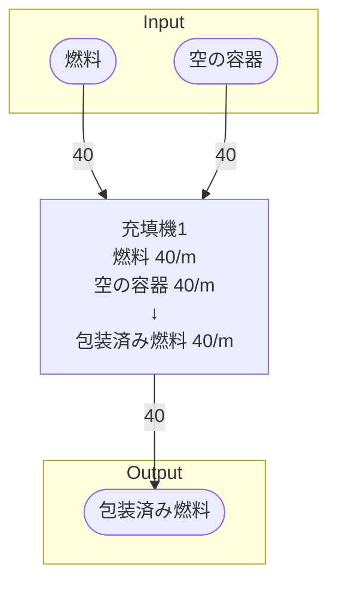

# 個別製造ライン設計書 包装済み燃料製造ライン

## 概要
以下の物品を生産する

- 包装済み燃料

## Input
- 燃料 40/m
- 空の容器 40/m

## Output
- 包装済み燃料 40/m

## 必要設備
- 充填機 1ケ
- ベルトコンベア類 適量

## 製造ライン

```mermaid
flowchart TD

subgraph Input
    燃料([燃料])
    空の容器([空の容器])
end

充填機1[
    充填機1
    燃料 40/m
    空の容器 40/m
    ↓
    包装済み燃料 40/m
]

subgraph Output
    包装済み燃料([包装済み燃料])
end

燃料-->|40|充填機1
空の容器-->|40|充填機1
充填機1-->|40|包装済み燃料
```

## 情報
書類テンプレートバージョン : 1.5.0
