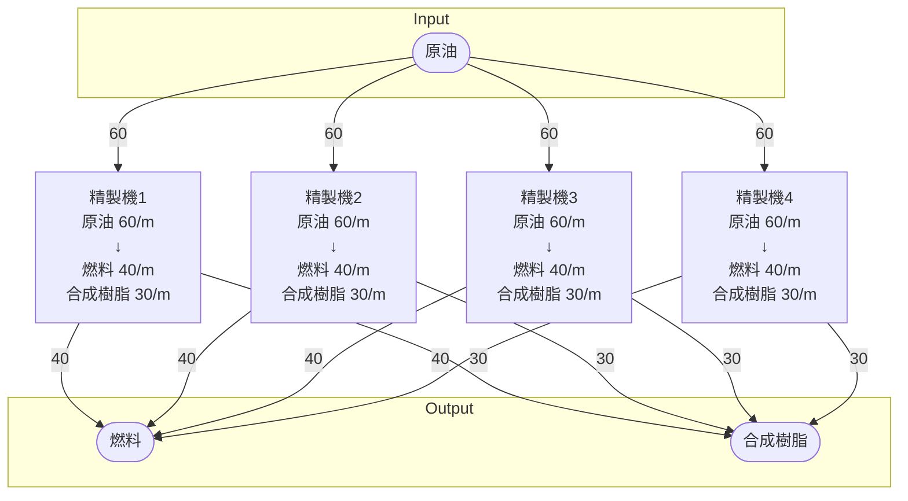

# 個別製造ライン設計書 燃料製造ライン

## 概要
以下の物品を生産する

- 燃料
- 合成樹脂

## Input
- 原油 240/m

## Output
- 燃料 160/m
- 合成樹脂 120/m

## 必要設備
- 精製機 4ケ
- ベルトコンベア類 適量

## 製造ライン

```mermaid
flowchart TD

subgraph Input
    原油([原油])
end

精製機1[
    精製機1
    原油 60/m
    ↓
    燃料 40/m
    合成樹脂 30/m
]

精製機2[
    精製機2
    原油 60/m
    ↓
    燃料 40/m
    合成樹脂 30/m
]

精製機3[
    精製機3
    原油 60/m
    ↓
    燃料 40/m
    合成樹脂 30/m
]

精製機4[
    精製機4
    原油 60/m
    ↓
    燃料 40/m
    合成樹脂 30/m
]

subgraph Output
    燃料([燃料])
    合成樹脂([合成樹脂])
end

原油-->|60|精製機1
精製機1-->|40|燃料
精製機1-->|30|合成樹脂
原油-->|60|精製機2
精製機2-->|40|燃料
精製機2-->|30|合成樹脂
原油-->|60|精製機3
精製機3-->|40|燃料
精製機3-->|30|合成樹脂
原油-->|60|精製機4
精製機4-->|40|燃料
精製機4-->|30|合成樹脂
```

## 情報
書類テンプレートバージョン : 1.5.0
