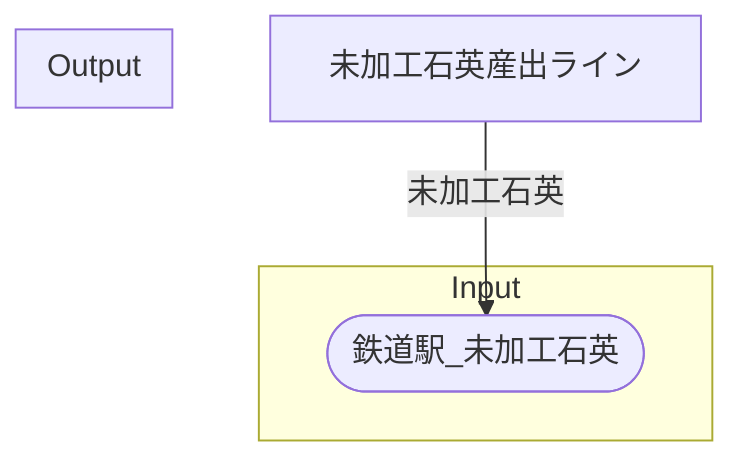

# シドニー未加工石英保管場 全体製造ライン設計書

## 資源
|資源名|産出量|
|---|---|
|未加工石英|240|

## 製造ラインフローチャート

```mermaid
flowchart TD
subgraph Input
    鉄道駅_未加工石英([鉄道駅_未加工石英])
end

subgraph Output
    鉄道駅_未加工石英([鉄道駅_未加工石英])
end

未加工石英産出ライン-->|未加工石英|鉄道駅_未加工石英
```

## 情報
書類テンプレートバージョン : 1.7.0
