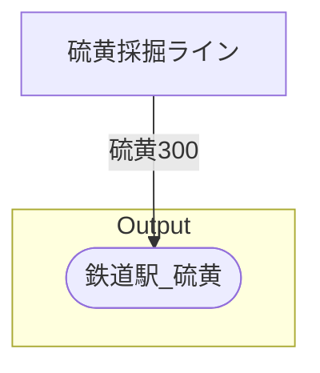

# ストックホルム硫黄採掘場 全体製造ライン設計書

## 資源
|資源名|産出量|
|---|---|
|硫黄|240|

## 製造ラインフローチャート

```mermaid
flowchart TD
subgraph Output
    鉄道駅_硫黄([鉄道駅_硫黄])
end

硫黄採掘ライン-->|硫黄300|鉄道駅_硫黄
```

## 情報
書類テンプレートバージョン : 1.7.0
