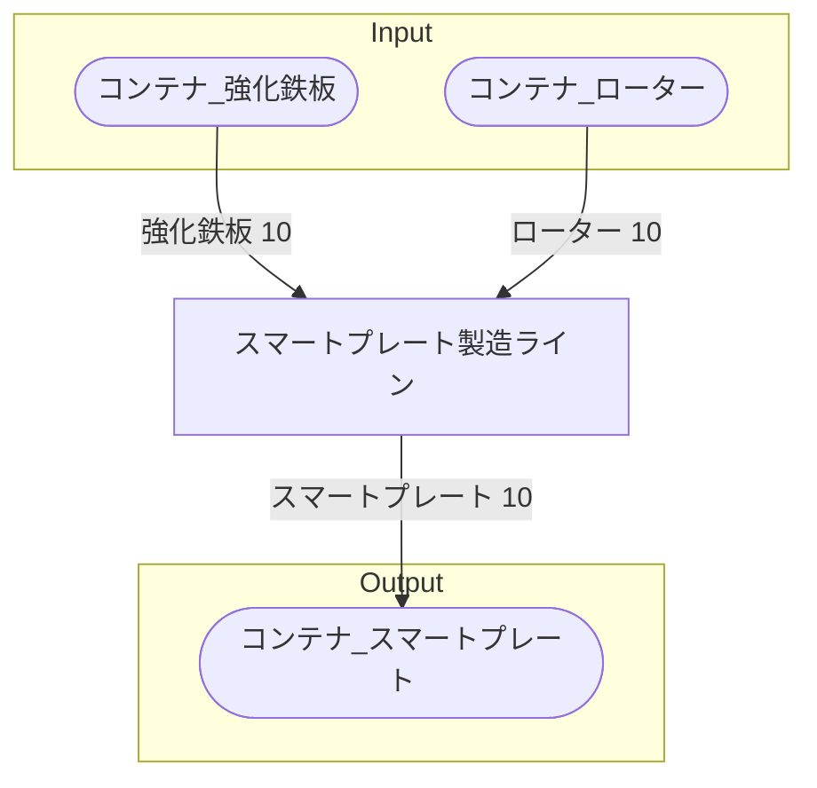

# スマートプレート 全体製造ライン設計書

## 使用レシピ
### スマートプレート
|Input|Output|
|---|---|
|強化鉄板 10/m|スマートプレート 10/m|
|ローター 10/m||

## 必要製造ライン
### スマートプレート製造ライン
|レシピ名|数|Input計|Output計|
|---|---|---|---|
|スマートプレート|5|強化鉄板 10/m|ローター 10/m|

## 製造ラインフローチャート

## 情報
書類テンプレートバージョン : 1.7.0
