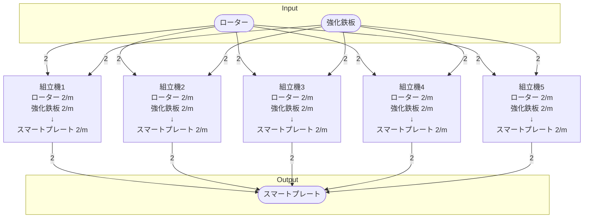

# 個別製造ライン設計書 スマートプレート製造ライン

## 概要
以下の物品を生産する

- スマートプレート

## Input
- ローター 10/m
- 強化鉄板 10/m

## Output
- スマートプレート 10/m

## 必要設備
- 組立機 5ケ
- ベルトコンベア類 適量

## 製造ライン

```mermaid
flowchart TD

subgraph Input
    ローター([ローター])
    強化鉄板([強化鉄板])
end

組立機1[
    組立機1
    ローター 2/m
    強化鉄板 2/m
    ↓
    スマートプレート 2/m
]

組立機2[
    組立機2
    ローター 2/m
    強化鉄板 2/m
    ↓
    スマートプレート 2/m
]

組立機3[
    組立機3
    ローター 2/m
    強化鉄板 2/m
    ↓
    スマートプレート 2/m
]

組立機4[
    組立機4
    ローター 2/m
    強化鉄板 2/m
    ↓
    スマートプレート 2/m
]

組立機5[
    組立機5
    ローター 2/m
    強化鉄板 2/m
    ↓
    スマートプレート 2/m
]

subgraph Output
    スマートプレート([スマートプレート])
end

ローター-->|2|組立機1
強化鉄板-->|2|組立機1
組立機1-->|2|スマートプレート
ローター-->|2|組立機2
強化鉄板-->|2|組立機2
組立機2-->|2|スマートプレート
ローター-->|2|組立機3
強化鉄板-->|2|組立機3
組立機3-->|2|スマートプレート
ローター-->|2|組立機4
強化鉄板-->|2|組立機4
組立機4-->|2|スマートプレート
ローター-->|2|組立機5
強化鉄板-->|2|組立機5
組立機5-->|2|スマートプレート
```

## 情報
書類テンプレートバージョン : 1.5.0
