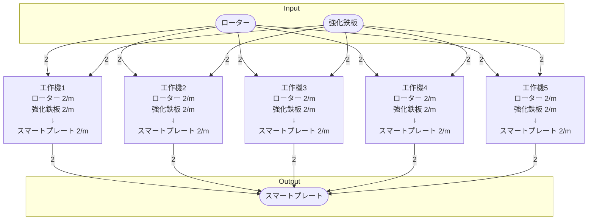

# 個別製造ライン設計書 スマートプレート製造ライン

## 概要
スマートプレートを製造するライン

## Input
- ローター 10/m
- 強化鉄板 10/m

## Output
- スマートプレート 10/m

## 必要設備
- 工作機 5ケ
- ベルトコンベア類 適量

## 製造ライン

```mermaid
flowchart TD

subgraph Input
    ローター([ローター])
    強化鉄板([強化鉄板])
end

工作機1[
    工作機1
    ローター 2/m
    強化鉄板 2/m
    ↓
    スマートプレート 2/m
]

工作機2[
    工作機2
    ローター 2/m
    強化鉄板 2/m
    ↓
    スマートプレート 2/m
]

工作機3[
    工作機3
    ローター 2/m
    強化鉄板 2/m
    ↓
    スマートプレート 2/m
]

工作機4[
    工作機4
    ローター 2/m
    強化鉄板 2/m
    ↓
    スマートプレート 2/m
]

工作機5[
    工作機5
    ローター 2/m
    強化鉄板 2/m
    ↓
    スマートプレート 2/m
]

subgraph Output
    スマートプレート([スマートプレート])
end

ローター-->|2|工作機1
強化鉄板-->|2|工作機1
工作機1-->|2|スマートプレート
ローター-->|2|工作機2
強化鉄板-->|2|工作機2
工作機2-->|2|スマートプレート
ローター-->|2|工作機3
強化鉄板-->|2|工作機3
工作機3-->|2|スマートプレート
ローター-->|2|工作機4
強化鉄板-->|2|工作機4
工作機4-->|2|スマートプレート
ローター-->|2|工作機5
強化鉄板-->|2|工作機5
工作機5-->|2|スマートプレート
```

## 情報
書類テンプレートバージョン : 1.5.0
