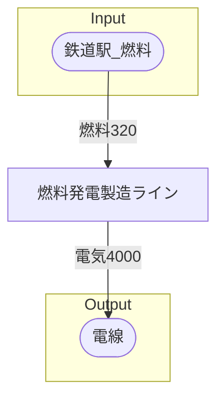

# ティルブルフ燃料式発電所 全体製造ライン設計書

## 使用レシピ

### 燃料発電
|I/O|物品名|要求数|
|---|---|---|
|input|燃料|20|
|---|---|---|

## 必要製造ライン
### 燃料発電製造ライン

レシピ名 : 燃料発電  
レシピ数 : 16

|I/O|物品名|要求数|
|---|---|---|
|input|燃料|320|
|---|---|---|

## 製造ラインフローチャート

## 情報
書類テンプレートバージョン : 1.7.0
