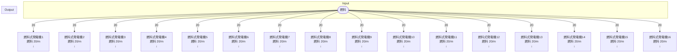

# 個別製造ライン設計書 燃料発電製造ライン

## 概要
以下の物品を生産する

## Input
- 燃料 320/m

## Output

## 必要設備
- 燃料式発電機 16ケ
- ベルトコンベア類 適量

## 製造ライン

```mermaid
flowchart TD

subgraph Input
    燃料([燃料])
end

燃料式発電機1[
    燃料式発電機1
    燃料 20/m
    ↓
]

燃料式発電機2[
    燃料式発電機2
    燃料 20/m
    ↓
]

燃料式発電機3[
    燃料式発電機3
    燃料 20/m
    ↓
]

燃料式発電機4[
    燃料式発電機4
    燃料 20/m
    ↓
]

燃料式発電機5[
    燃料式発電機5
    燃料 20/m
    ↓
]

燃料式発電機6[
    燃料式発電機6
    燃料 20/m
    ↓
]

燃料式発電機7[
    燃料式発電機7
    燃料 20/m
    ↓
]

燃料式発電機8[
    燃料式発電機8
    燃料 20/m
    ↓
]

燃料式発電機9[
    燃料式発電機9
    燃料 20/m
    ↓
]

燃料式発電機10[
    燃料式発電機10
    燃料 20/m
    ↓
]

燃料式発電機11[
    燃料式発電機11
    燃料 20/m
    ↓
]

燃料式発電機12[
    燃料式発電機12
    燃料 20/m
    ↓
]

燃料式発電機13[
    燃料式発電機13
    燃料 20/m
    ↓
]

燃料式発電機14[
    燃料式発電機14
    燃料 20/m
    ↓
]

燃料式発電機15[
    燃料式発電機15
    燃料 20/m
    ↓
]

燃料式発電機16[
    燃料式発電機16
    燃料 20/m
    ↓
]

subgraph Output
end

燃料-->|20|燃料式発電機1
燃料-->|20|燃料式発電機2
燃料-->|20|燃料式発電機3
燃料-->|20|燃料式発電機4
燃料-->|20|燃料式発電機5
燃料-->|20|燃料式発電機6
燃料-->|20|燃料式発電機7
燃料-->|20|燃料式発電機8
燃料-->|20|燃料式発電機9
燃料-->|20|燃料式発電機10
燃料-->|20|燃料式発電機11
燃料-->|20|燃料式発電機12
燃料-->|20|燃料式発電機13
燃料-->|20|燃料式発電機14
燃料-->|20|燃料式発電機15
燃料-->|20|燃料式発電機16
```

## 情報
書類テンプレートバージョン : 1.5.0
