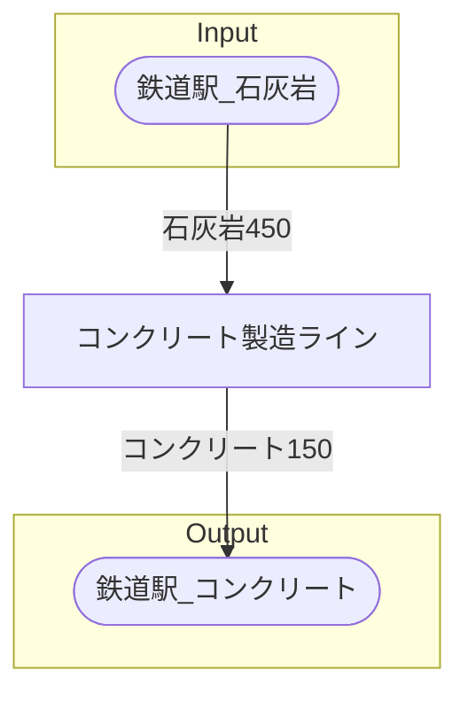

# デンボスコンクリート工場 全体製造ライン設計書

## 使用レシピ

### コンクリート
|I/O|物品名|要求数|
|---|---|---|
|input|石灰岩|45|
|---|---|---|
|output|コンクリート|15|

## 必要製造ライン
### コンクリート製造ライン

レシピ名 : コンクリート  
レシピ数 : 10

|I/O|物品名|要求数|
|---|---|---|
|input|石灰岩|450|
|---|---|---|
|output|コンクリート|150|

## 製造ラインフローチャート

## 情報
書類テンプレートバージョン : 1.7.0
