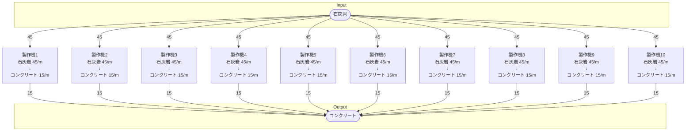

# 個別製造ライン設計書 コンクリート製造ライン

## 概要
以下の物品を生産する

- コンクリート

## Input
- 石灰岩 450/m

## Output
- コンクリート 150/m

## 必要設備
- 製作機 10ケ
- ベルトコンベア類 適量

## 製造ライン

```mermaid
flowchart TD

subgraph Input
    石灰岩([石灰岩])
end

製作機1[
    製作機1
    石灰岩 45/m
    ↓
    コンクリート 15/m
]

製作機2[
    製作機2
    石灰岩 45/m
    ↓
    コンクリート 15/m
]

製作機3[
    製作機3
    石灰岩 45/m
    ↓
    コンクリート 15/m
]

製作機4[
    製作機4
    石灰岩 45/m
    ↓
    コンクリート 15/m
]

製作機5[
    製作機5
    石灰岩 45/m
    ↓
    コンクリート 15/m
]

製作機6[
    製作機6
    石灰岩 45/m
    ↓
    コンクリート 15/m
]

製作機7[
    製作機7
    石灰岩 45/m
    ↓
    コンクリート 15/m
]

製作機8[
    製作機8
    石灰岩 45/m
    ↓
    コンクリート 15/m
]

製作機9[
    製作機9
    石灰岩 45/m
    ↓
    コンクリート 15/m
]

製作機10[
    製作機10
    石灰岩 45/m
    ↓
    コンクリート 15/m
]

subgraph Output
    コンクリート([コンクリート])
end

石灰岩-->|45|製作機1
製作機1-->|15|コンクリート
石灰岩-->|45|製作機2
製作機2-->|15|コンクリート
石灰岩-->|45|製作機3
製作機3-->|15|コンクリート
石灰岩-->|45|製作機4
製作機4-->|15|コンクリート
石灰岩-->|45|製作機5
製作機5-->|15|コンクリート
石灰岩-->|45|製作機6
製作機6-->|15|コンクリート
石灰岩-->|45|製作機7
製作機7-->|15|コンクリート
石灰岩-->|45|製作機8
製作機8-->|15|コンクリート
石灰岩-->|45|製作機9
製作機9-->|15|コンクリート
石灰岩-->|45|製作機10
製作機10-->|15|コンクリート
```

## 情報
書類テンプレートバージョン : 1.5.0
