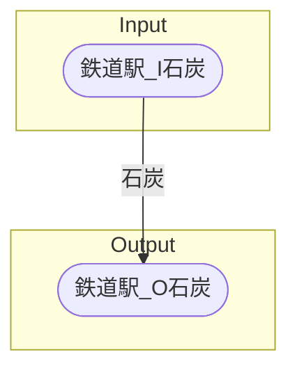

# ドネツ石炭保管場 全体製造ライン設計書

## 資源
|資源名|産出量|
|---|---|
|石炭|840|

## 製造ラインフローチャート

```mermaid
flowchart TD
subgraph Input
    鉄道駅_I石炭([鉄道駅_I石炭])
end

subgraph Output
    鉄道駅_O石炭([鉄道駅_O石炭])
end

鉄道駅_I石炭-->|石炭|鉄道駅_O石炭
```

## 情報
書類テンプレートバージョン : 1.7.0
