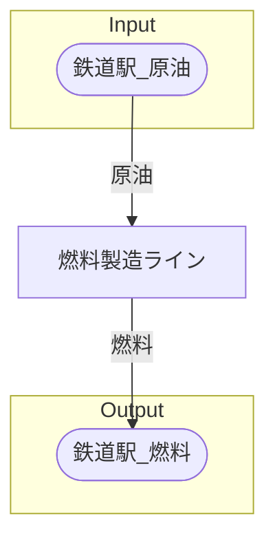

# ドバイ原油保管場 全体製造ライン設計書

## 使用レシピ
### 燃料
|I/O|物品名|要求数|
|---|---|---|
|input|原油|60|
|---|---|---|
|output|燃料|40|
|output|合成樹脂|30|

## 必要製造ライン
### 燃料製造ライン

レシピ名 : 燃料  
レシピ数 : 32

|I/O|物品名|要求数|
|---|---|---|
|input|原油|1920|
|---|---|---|
|output|燃料|1280|
|output|合成樹脂|960|

## 製造ラインフローチャート

## 情報
書類テンプレートバージョン : 1.7.0
