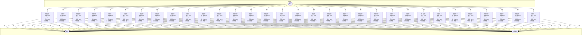

# 個別製造ライン設計書 燃料製造ライン

## 概要
以下の物品を生産する

- 燃料
- 合成樹脂

## Input
- 原油 1920/m

## Output
- 燃料 1280/m
- 合成樹脂 960/m

## 必要設備
- 精製機 32ケ
- ベルトコンベア類 適量

## 製造ライン

```mermaid
flowchart TD

subgraph Input
    原油([原油])
end

精製機1[
    精製機1
    原油 60/m
    ↓
    燃料 40/m
    合成樹脂 30/m
]

精製機2[
    精製機2
    原油 60/m
    ↓
    燃料 40/m
    合成樹脂 30/m
]

精製機3[
    精製機3
    原油 60/m
    ↓
    燃料 40/m
    合成樹脂 30/m
]

精製機4[
    精製機4
    原油 60/m
    ↓
    燃料 40/m
    合成樹脂 30/m
]

精製機5[
    精製機5
    原油 60/m
    ↓
    燃料 40/m
    合成樹脂 30/m
]

精製機6[
    精製機6
    原油 60/m
    ↓
    燃料 40/m
    合成樹脂 30/m
]

精製機7[
    精製機7
    原油 60/m
    ↓
    燃料 40/m
    合成樹脂 30/m
]

精製機8[
    精製機8
    原油 60/m
    ↓
    燃料 40/m
    合成樹脂 30/m
]

精製機9[
    精製機9
    原油 60/m
    ↓
    燃料 40/m
    合成樹脂 30/m
]

精製機10[
    精製機10
    原油 60/m
    ↓
    燃料 40/m
    合成樹脂 30/m
]

精製機11[
    精製機11
    原油 60/m
    ↓
    燃料 40/m
    合成樹脂 30/m
]

精製機12[
    精製機12
    原油 60/m
    ↓
    燃料 40/m
    合成樹脂 30/m
]

精製機13[
    精製機13
    原油 60/m
    ↓
    燃料 40/m
    合成樹脂 30/m
]

精製機14[
    精製機14
    原油 60/m
    ↓
    燃料 40/m
    合成樹脂 30/m
]

精製機15[
    精製機15
    原油 60/m
    ↓
    燃料 40/m
    合成樹脂 30/m
]

精製機16[
    精製機16
    原油 60/m
    ↓
    燃料 40/m
    合成樹脂 30/m
]

精製機17[
    精製機17
    原油 60/m
    ↓
    燃料 40/m
    合成樹脂 30/m
]

精製機18[
    精製機18
    原油 60/m
    ↓
    燃料 40/m
    合成樹脂 30/m
]

精製機19[
    精製機19
    原油 60/m
    ↓
    燃料 40/m
    合成樹脂 30/m
]

精製機20[
    精製機20
    原油 60/m
    ↓
    燃料 40/m
    合成樹脂 30/m
]

精製機21[
    精製機21
    原油 60/m
    ↓
    燃料 40/m
    合成樹脂 30/m
]

精製機22[
    精製機22
    原油 60/m
    ↓
    燃料 40/m
    合成樹脂 30/m
]

精製機23[
    精製機23
    原油 60/m
    ↓
    燃料 40/m
    合成樹脂 30/m
]

精製機24[
    精製機24
    原油 60/m
    ↓
    燃料 40/m
    合成樹脂 30/m
]

精製機25[
    精製機25
    原油 60/m
    ↓
    燃料 40/m
    合成樹脂 30/m
]

精製機26[
    精製機26
    原油 60/m
    ↓
    燃料 40/m
    合成樹脂 30/m
]

精製機27[
    精製機27
    原油 60/m
    ↓
    燃料 40/m
    合成樹脂 30/m
]

精製機28[
    精製機28
    原油 60/m
    ↓
    燃料 40/m
    合成樹脂 30/m
]

精製機29[
    精製機29
    原油 60/m
    ↓
    燃料 40/m
    合成樹脂 30/m
]

精製機30[
    精製機30
    原油 60/m
    ↓
    燃料 40/m
    合成樹脂 30/m
]

精製機31[
    精製機31
    原油 60/m
    ↓
    燃料 40/m
    合成樹脂 30/m
]

精製機32[
    精製機32
    原油 60/m
    ↓
    燃料 40/m
    合成樹脂 30/m
]

subgraph Output
    燃料([燃料])
    合成樹脂([合成樹脂])
end

原油-->|60|精製機1
精製機1-->|40|燃料
精製機1-->|30|合成樹脂
原油-->|60|精製機2
精製機2-->|40|燃料
精製機2-->|30|合成樹脂
原油-->|60|精製機3
精製機3-->|40|燃料
精製機3-->|30|合成樹脂
原油-->|60|精製機4
精製機4-->|40|燃料
精製機4-->|30|合成樹脂
原油-->|60|精製機5
精製機5-->|40|燃料
精製機5-->|30|合成樹脂
原油-->|60|精製機6
精製機6-->|40|燃料
精製機6-->|30|合成樹脂
原油-->|60|精製機7
精製機7-->|40|燃料
精製機7-->|30|合成樹脂
原油-->|60|精製機8
精製機8-->|40|燃料
精製機8-->|30|合成樹脂
原油-->|60|精製機9
精製機9-->|40|燃料
精製機9-->|30|合成樹脂
原油-->|60|精製機10
精製機10-->|40|燃料
精製機10-->|30|合成樹脂
原油-->|60|精製機11
精製機11-->|40|燃料
精製機11-->|30|合成樹脂
原油-->|60|精製機12
精製機12-->|40|燃料
精製機12-->|30|合成樹脂
原油-->|60|精製機13
精製機13-->|40|燃料
精製機13-->|30|合成樹脂
原油-->|60|精製機14
精製機14-->|40|燃料
精製機14-->|30|合成樹脂
原油-->|60|精製機15
精製機15-->|40|燃料
精製機15-->|30|合成樹脂
原油-->|60|精製機16
精製機16-->|40|燃料
精製機16-->|30|合成樹脂
原油-->|60|精製機17
精製機17-->|40|燃料
精製機17-->|30|合成樹脂
原油-->|60|精製機18
精製機18-->|40|燃料
精製機18-->|30|合成樹脂
原油-->|60|精製機19
精製機19-->|40|燃料
精製機19-->|30|合成樹脂
原油-->|60|精製機20
精製機20-->|40|燃料
精製機20-->|30|合成樹脂
原油-->|60|精製機21
精製機21-->|40|燃料
精製機21-->|30|合成樹脂
原油-->|60|精製機22
精製機22-->|40|燃料
精製機22-->|30|合成樹脂
原油-->|60|精製機23
精製機23-->|40|燃料
精製機23-->|30|合成樹脂
原油-->|60|精製機24
精製機24-->|40|燃料
精製機24-->|30|合成樹脂
原油-->|60|精製機25
精製機25-->|40|燃料
精製機25-->|30|合成樹脂
原油-->|60|精製機26
精製機26-->|40|燃料
精製機26-->|30|合成樹脂
原油-->|60|精製機27
精製機27-->|40|燃料
精製機27-->|30|合成樹脂
原油-->|60|精製機28
精製機28-->|40|燃料
精製機28-->|30|合成樹脂
原油-->|60|精製機29
精製機29-->|40|燃料
精製機29-->|30|合成樹脂
原油-->|60|精製機30
精製機30-->|40|燃料
精製機30-->|30|合成樹脂
原油-->|60|精製機31
精製機31-->|40|燃料
精製機31-->|30|合成樹脂
原油-->|60|精製機32
精製機32-->|40|燃料
精製機32-->|30|合成樹脂
```

## 情報
書類テンプレートバージョン : 1.5.0
