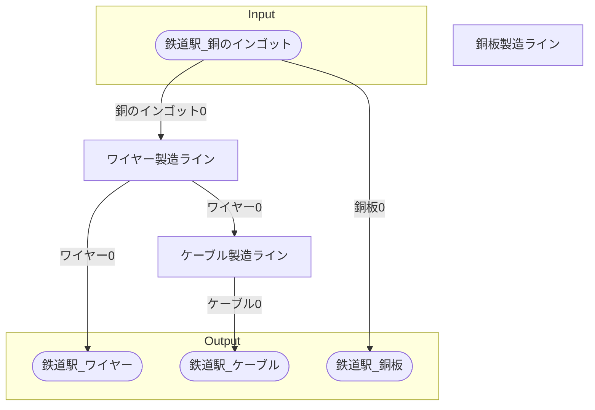

# ドルトレヒト銅製品工場 全体製造ライン設計書

## 必要製造ライン
### ワイヤー製造ライン

レシピ名 : ワイヤー  
レシピ数 : 10

|I/O|物品名|要求数|
|---|---|---|
|input|銅のインゴット|150|
|---|---|---|
|output|ワイヤー|300|

### ケーブル製造ライン

レシピ名 : ケーブル  
レシピ数 : 10

|I/O|物品名|要求数|
|---|---|---|
|input|ワイヤー|600|
|---|---|---|
|output|ケーブル|300|

### 銅板製造ライン

レシピ名 : 銅板  
レシピ数 : 10

|I/O|物品名|要求数|
|---|---|---|
|input|銅のインゴット|300|
|---|---|---|
|output|銅板|150|

## 製造ラインフローチャート

## 情報
書類テンプレートバージョン : 1.7.0
