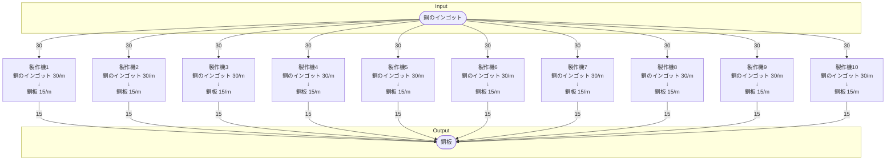

# 個別製造ライン設計書 銅板製造ライン

## 概要
以下の物品を生産する

- 銅板

## Input
- 銅のインゴット 300/m

## Output
- 銅板 150/m

## 必要設備
- 製作機 10ケ
- ベルトコンベア類 適量

## 製造ライン

```mermaid
flowchart TD

subgraph Input
    銅のインゴット([銅のインゴット])
end

製作機1[
    製作機1
    銅のインゴット 30/m
    ↓
    銅板 15/m
]

製作機2[
    製作機2
    銅のインゴット 30/m
    ↓
    銅板 15/m
]

製作機3[
    製作機3
    銅のインゴット 30/m
    ↓
    銅板 15/m
]

製作機4[
    製作機4
    銅のインゴット 30/m
    ↓
    銅板 15/m
]

製作機5[
    製作機5
    銅のインゴット 30/m
    ↓
    銅板 15/m
]

製作機6[
    製作機6
    銅のインゴット 30/m
    ↓
    銅板 15/m
]

製作機7[
    製作機7
    銅のインゴット 30/m
    ↓
    銅板 15/m
]

製作機8[
    製作機8
    銅のインゴット 30/m
    ↓
    銅板 15/m
]

製作機9[
    製作機9
    銅のインゴット 30/m
    ↓
    銅板 15/m
]

製作機10[
    製作機10
    銅のインゴット 30/m
    ↓
    銅板 15/m
]

subgraph Output
    銅板([銅板])
end

銅のインゴット-->|30|製作機1
製作機1-->|15|銅板
銅のインゴット-->|30|製作機2
製作機2-->|15|銅板
銅のインゴット-->|30|製作機3
製作機3-->|15|銅板
銅のインゴット-->|30|製作機4
製作機4-->|15|銅板
銅のインゴット-->|30|製作機5
製作機5-->|15|銅板
銅のインゴット-->|30|製作機6
製作機6-->|15|銅板
銅のインゴット-->|30|製作機7
製作機7-->|15|銅板
銅のインゴット-->|30|製作機8
製作機8-->|15|銅板
銅のインゴット-->|30|製作機9
製作機9-->|15|銅板
銅のインゴット-->|30|製作機10
製作機10-->|15|銅板
```

## 情報
書類テンプレートバージョン : 1.5.0
