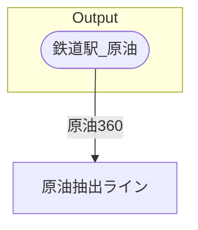

# ノヴォシビルスク油田 全体製造ライン設計書

## 資源
|資源名|産出量|
|---|---|
|原油|360|

## 製造ラインフローチャート

```mermaid
flowchart TD
subgraph Output
    鉄道駅_原油([鉄道駅_原油])
end

鉄道駅_原油-->|原油360|原油抽出ライン
```

## 情報
書類テンプレートバージョン : 1.7.0
