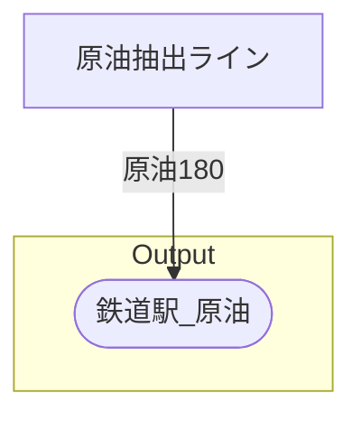

# ノヴォシビルスク油田 全体製造ライン設計書

## 資源
### 原油
- 合計産出量 : 360

## 使用レシピ
なし

## 必要製造ライン
なし

## 製造ラインフローチャート

```mermaid
flowchart TD

subgraph Output
    鉄道駅_原油([鉄道駅_原油])
end

原油抽出ライン-->|原油180|鉄道駅_原油
```

## 情報
書類テンプレートバージョン : 1.7.0
