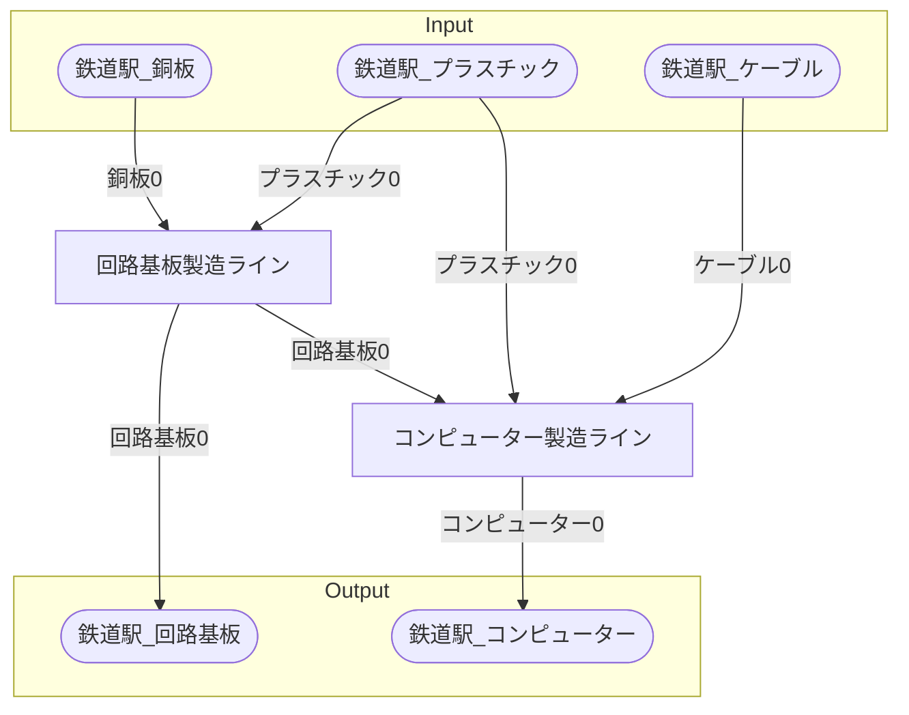

# ノーショーピング電子機器工場 全体製造ライン設計書

## 必要製造ライン
### 回路基板製造ライン

レシピ名 : 回路基板  
レシピ数 : 8

|I/O|物品名|要求数|
|---|---|---|
|input|銅板|120|
|input|プラスチック|240|
|---|---|---|
|output|回路基板|60.0|

### コンピューター製造ライン

レシピ名 : コンピューター  
レシピ数 : 4

|I/O|物品名|要求数|
|---|---|---|
|input|回路基板|40|
|input|ケーブル|80|
|input|プラスチック|160|
|---|---|---|
|output|コンピューター|10.0|

## 製造ラインフローチャート

## 情報
書類テンプレートバージョン : 1.7.0
