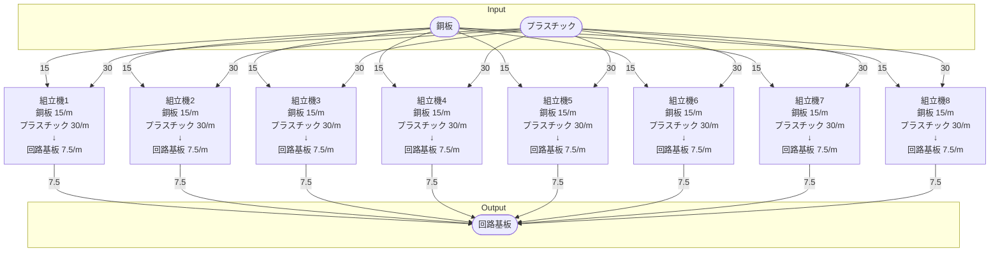

# 個別製造ライン設計書 回路基板製造ライン

## 概要
以下の物品を生産する

- 回路基板

## Input
- 銅板 120/m
- プラスチック 240/m

## Output
- 回路基板 60.0/m

## 必要設備
- 組立機 8ケ
- ベルトコンベア類 適量

## 製造ライン

```mermaid
flowchart TD

subgraph Input
    銅板([銅板])
    プラスチック([プラスチック])
end

組立機1[
    組立機1
    銅板 15/m
    プラスチック 30/m
    ↓
    回路基板 7.5/m
]

組立機2[
    組立機2
    銅板 15/m
    プラスチック 30/m
    ↓
    回路基板 7.5/m
]

組立機3[
    組立機3
    銅板 15/m
    プラスチック 30/m
    ↓
    回路基板 7.5/m
]

組立機4[
    組立機4
    銅板 15/m
    プラスチック 30/m
    ↓
    回路基板 7.5/m
]

組立機5[
    組立機5
    銅板 15/m
    プラスチック 30/m
    ↓
    回路基板 7.5/m
]

組立機6[
    組立機6
    銅板 15/m
    プラスチック 30/m
    ↓
    回路基板 7.5/m
]

組立機7[
    組立機7
    銅板 15/m
    プラスチック 30/m
    ↓
    回路基板 7.5/m
]

組立機8[
    組立機8
    銅板 15/m
    プラスチック 30/m
    ↓
    回路基板 7.5/m
]

subgraph Output
    回路基板([回路基板])
end

銅板-->|15|組立機1
プラスチック-->|30|組立機1
組立機1-->|7.5|回路基板
銅板-->|15|組立機2
プラスチック-->|30|組立機2
組立機2-->|7.5|回路基板
銅板-->|15|組立機3
プラスチック-->|30|組立機3
組立機3-->|7.5|回路基板
銅板-->|15|組立機4
プラスチック-->|30|組立機4
組立機4-->|7.5|回路基板
銅板-->|15|組立機5
プラスチック-->|30|組立機5
組立機5-->|7.5|回路基板
銅板-->|15|組立機6
プラスチック-->|30|組立機6
組立機6-->|7.5|回路基板
銅板-->|15|組立機7
プラスチック-->|30|組立機7
組立機7-->|7.5|回路基板
銅板-->|15|組立機8
プラスチック-->|30|組立機8
組立機8-->|7.5|回路基板
```

## 情報
書類テンプレートバージョン : 1.5.0
