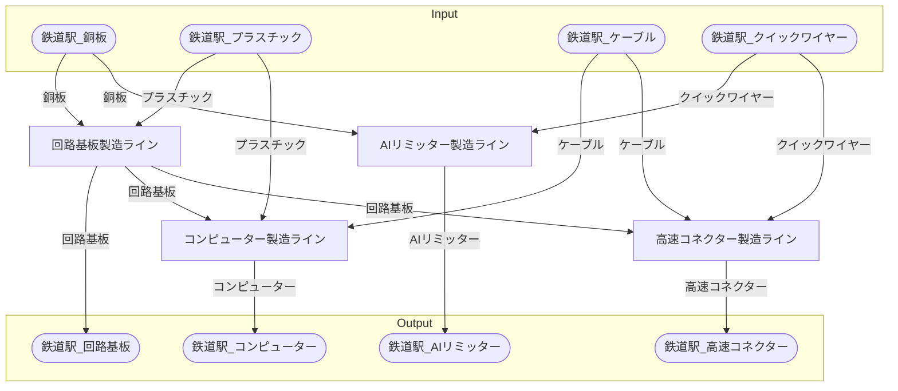

# ノーショーピング電子機器工場 全体製造ライン設計書

## 使用レシピ
### 回路基板
|I/O|物品名|要求数|
|---|---|---|
|input|銅板|15|
|input|プラスチック|30|
|---|---|---|
|output|回路基板|7.5|
### コンピューター
|I/O|物品名|要求数|
|---|---|---|
|input|回路基板|10|
|input|ケーブル|20|
|input|プラスチック|40|
|---|---|---|
|output|コンピューター|2.5|
### AIリミッター
|I/O|物品名|要求数|
|---|---|---|
|input|銅板|25|
|input|クイックワイヤー|100|
|---|---|---|
|output|AIリミッター|5|
### 高速コネクター
|I/O|物品名|要求数|
|---|---|---|
|input|ケーブル|37.5|
|input|回路基板|3.75|
|input|クイックワイヤー|210|
|---|---|---|
|output|高速コネクター|3.75|

## 必要製造ライン
### 回路基板製造ライン

レシピ名 : 回路基板  
レシピ数 : 32

|I/O|物品名|要求数|
|---|---|---|
|input|銅板|480|
|input|プラスチック|960|
|---|---|---|
|output|回路基板|240.0|

### コンピューター製造ライン

レシピ名 : コンピューター  
レシピ数 : 8

|I/O|物品名|要求数|
|---|---|---|
|input|回路基板|80|
|input|ケーブル|160|
|input|プラスチック|320|
|---|---|---|
|output|コンピューター|20.0|

### AIリミッター製造ライン

レシピ名 : AIリミッター  
レシピ数 : 16

|I/O|物品名|要求数|
|---|---|---|
|input|銅板|400|
|input|クイックワイヤー|1600|
|---|---|---|
|output|AIリミッター|80|

### 高速コネクター製造ライン

レシピ名 : 高速コネクター  
レシピ数 : 4

|I/O|物品名|要求数|
|---|---|---|
|input|ケーブル|150.0|
|input|回路基板|15.0|
|input|クイックワイヤー|840|
|---|---|---|
|output|高速コネクター|15.0|

## 製造ラインフローチャート

## 情報
書類テンプレートバージョン : 1.7.0
