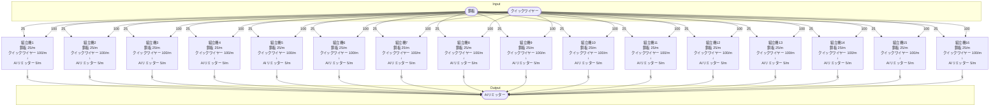

# 個別製造ライン設計書 AIリミッター製造ライン

## 概要
以下の物品を生産する

- AIリミッター

## Input
- 銅板 400/m
- クイックワイヤー 1600/m

## Output
- AIリミッター 80/m

## 必要設備
- 組立機 16ケ
- ベルトコンベア類 適量

## 製造ライン

```mermaid
flowchart TD

subgraph Input
    銅板([銅板])
    クイックワイヤー([クイックワイヤー])
end

組立機1[
    組立機1
    銅板 25/m
    クイックワイヤー 100/m
    ↓
    AIリミッター 5/m
]

組立機2[
    組立機2
    銅板 25/m
    クイックワイヤー 100/m
    ↓
    AIリミッター 5/m
]

組立機3[
    組立機3
    銅板 25/m
    クイックワイヤー 100/m
    ↓
    AIリミッター 5/m
]

組立機4[
    組立機4
    銅板 25/m
    クイックワイヤー 100/m
    ↓
    AIリミッター 5/m
]

組立機5[
    組立機5
    銅板 25/m
    クイックワイヤー 100/m
    ↓
    AIリミッター 5/m
]

組立機6[
    組立機6
    銅板 25/m
    クイックワイヤー 100/m
    ↓
    AIリミッター 5/m
]

組立機7[
    組立機7
    銅板 25/m
    クイックワイヤー 100/m
    ↓
    AIリミッター 5/m
]

組立機8[
    組立機8
    銅板 25/m
    クイックワイヤー 100/m
    ↓
    AIリミッター 5/m
]

組立機9[
    組立機9
    銅板 25/m
    クイックワイヤー 100/m
    ↓
    AIリミッター 5/m
]

組立機10[
    組立機10
    銅板 25/m
    クイックワイヤー 100/m
    ↓
    AIリミッター 5/m
]

組立機11[
    組立機11
    銅板 25/m
    クイックワイヤー 100/m
    ↓
    AIリミッター 5/m
]

組立機12[
    組立機12
    銅板 25/m
    クイックワイヤー 100/m
    ↓
    AIリミッター 5/m
]

組立機13[
    組立機13
    銅板 25/m
    クイックワイヤー 100/m
    ↓
    AIリミッター 5/m
]

組立機14[
    組立機14
    銅板 25/m
    クイックワイヤー 100/m
    ↓
    AIリミッター 5/m
]

組立機15[
    組立機15
    銅板 25/m
    クイックワイヤー 100/m
    ↓
    AIリミッター 5/m
]

組立機16[
    組立機16
    銅板 25/m
    クイックワイヤー 100/m
    ↓
    AIリミッター 5/m
]

subgraph Output
    AIリミッター([AIリミッター])
end

銅板-->|25|組立機1
クイックワイヤー-->|100|組立機1
組立機1-->|5|AIリミッター
銅板-->|25|組立機2
クイックワイヤー-->|100|組立機2
組立機2-->|5|AIリミッター
銅板-->|25|組立機3
クイックワイヤー-->|100|組立機3
組立機3-->|5|AIリミッター
銅板-->|25|組立機4
クイックワイヤー-->|100|組立機4
組立機4-->|5|AIリミッター
銅板-->|25|組立機5
クイックワイヤー-->|100|組立機5
組立機5-->|5|AIリミッター
銅板-->|25|組立機6
クイックワイヤー-->|100|組立機6
組立機6-->|5|AIリミッター
銅板-->|25|組立機7
クイックワイヤー-->|100|組立機7
組立機7-->|5|AIリミッター
銅板-->|25|組立機8
クイックワイヤー-->|100|組立機8
組立機8-->|5|AIリミッター
銅板-->|25|組立機9
クイックワイヤー-->|100|組立機9
組立機9-->|5|AIリミッター
銅板-->|25|組立機10
クイックワイヤー-->|100|組立機10
組立機10-->|5|AIリミッター
銅板-->|25|組立機11
クイックワイヤー-->|100|組立機11
組立機11-->|5|AIリミッター
銅板-->|25|組立機12
クイックワイヤー-->|100|組立機12
組立機12-->|5|AIリミッター
銅板-->|25|組立機13
クイックワイヤー-->|100|組立機13
組立機13-->|5|AIリミッター
銅板-->|25|組立機14
クイックワイヤー-->|100|組立機14
組立機14-->|5|AIリミッター
銅板-->|25|組立機15
クイックワイヤー-->|100|組立機15
組立機15-->|5|AIリミッター
銅板-->|25|組立機16
クイックワイヤー-->|100|組立機16
組立機16-->|5|AIリミッター
```

## 情報
書類テンプレートバージョン : 1.5.0
