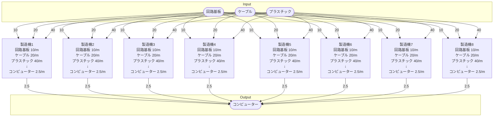

# 個別製造ライン設計書 コンピューター製造ライン

## 概要
以下の物品を生産する

- コンピューター

## Input
- 回路基板 80/m
- ケーブル 160/m
- プラスチック 320/m

## Output
- コンピューター 20.0/m

## 必要設備
- 製造機 8ケ
- ベルトコンベア類 適量

## 製造ライン

## 情報
書類テンプレートバージョン : 1.5.0
