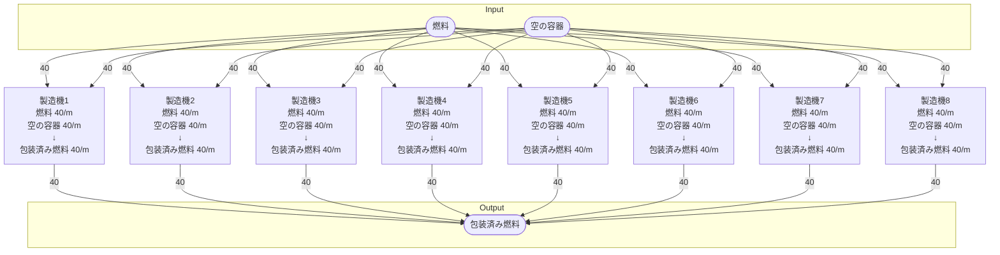

# 個別製造ライン設計書 包装済み燃料製造ライン

## 概要
以下の物品を生産する

- 包装済み燃料

## Input
- 燃料 320/m
- 空の容器 320/m

## Output
- 包装済み燃料 320/m

## 必要設備
- 製造機 8ケ
- ベルトコンベア類 適量

## 製造ライン

```mermaid
flowchart TD

subgraph Input
    燃料([燃料])
    空の容器([空の容器])
end

製造機1[
    製造機1
    燃料 40/m
    空の容器 40/m
    ↓
    包装済み燃料 40/m
]

製造機2[
    製造機2
    燃料 40/m
    空の容器 40/m
    ↓
    包装済み燃料 40/m
]

製造機3[
    製造機3
    燃料 40/m
    空の容器 40/m
    ↓
    包装済み燃料 40/m
]

製造機4[
    製造機4
    燃料 40/m
    空の容器 40/m
    ↓
    包装済み燃料 40/m
]

製造機5[
    製造機5
    燃料 40/m
    空の容器 40/m
    ↓
    包装済み燃料 40/m
]

製造機6[
    製造機6
    燃料 40/m
    空の容器 40/m
    ↓
    包装済み燃料 40/m
]

製造機7[
    製造機7
    燃料 40/m
    空の容器 40/m
    ↓
    包装済み燃料 40/m
]

製造機8[
    製造機8
    燃料 40/m
    空の容器 40/m
    ↓
    包装済み燃料 40/m
]

subgraph Output
    包装済み燃料([包装済み燃料])
end

燃料-->|40|製造機1
空の容器-->|40|製造機1
製造機1-->|40|包装済み燃料
燃料-->|40|製造機2
空の容器-->|40|製造機2
製造機2-->|40|包装済み燃料
燃料-->|40|製造機3
空の容器-->|40|製造機3
製造機3-->|40|包装済み燃料
燃料-->|40|製造機4
空の容器-->|40|製造機4
製造機4-->|40|包装済み燃料
燃料-->|40|製造機5
空の容器-->|40|製造機5
製造機5-->|40|包装済み燃料
燃料-->|40|製造機6
空の容器-->|40|製造機6
製造機6-->|40|包装済み燃料
燃料-->|40|製造機7
空の容器-->|40|製造機7
製造機7-->|40|包装済み燃料
燃料-->|40|製造機8
空の容器-->|40|製造機8
製造機8-->|40|包装済み燃料
```

## 情報
書類テンプレートバージョン : 1.5.0
