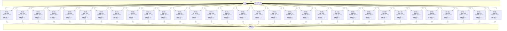

# 個別製造ライン設計書 回路基板製造ライン

## 概要
以下の物品を生産する

- 回路基板

## Input
- 銅板 480/m
- プラスチック 960/m

## Output
- 回路基板 240.0/m

## 必要設備
- 組立機 32ケ
- ベルトコンベア類 適量

## 製造ライン

```mermaid
flowchart TD

subgraph Input
    銅板([銅板])
    プラスチック([プラスチック])
end

組立機1[
    組立機1
    銅板 15/m
    プラスチック 30/m
    ↓
    回路基板 7.5/m
]

組立機2[
    組立機2
    銅板 15/m
    プラスチック 30/m
    ↓
    回路基板 7.5/m
]

組立機3[
    組立機3
    銅板 15/m
    プラスチック 30/m
    ↓
    回路基板 7.5/m
]

組立機4[
    組立機4
    銅板 15/m
    プラスチック 30/m
    ↓
    回路基板 7.5/m
]

組立機5[
    組立機5
    銅板 15/m
    プラスチック 30/m
    ↓
    回路基板 7.5/m
]

組立機6[
    組立機6
    銅板 15/m
    プラスチック 30/m
    ↓
    回路基板 7.5/m
]

組立機7[
    組立機7
    銅板 15/m
    プラスチック 30/m
    ↓
    回路基板 7.5/m
]

組立機8[
    組立機8
    銅板 15/m
    プラスチック 30/m
    ↓
    回路基板 7.5/m
]

組立機9[
    組立機9
    銅板 15/m
    プラスチック 30/m
    ↓
    回路基板 7.5/m
]

組立機10[
    組立機10
    銅板 15/m
    プラスチック 30/m
    ↓
    回路基板 7.5/m
]

組立機11[
    組立機11
    銅板 15/m
    プラスチック 30/m
    ↓
    回路基板 7.5/m
]

組立機12[
    組立機12
    銅板 15/m
    プラスチック 30/m
    ↓
    回路基板 7.5/m
]

組立機13[
    組立機13
    銅板 15/m
    プラスチック 30/m
    ↓
    回路基板 7.5/m
]

組立機14[
    組立機14
    銅板 15/m
    プラスチック 30/m
    ↓
    回路基板 7.5/m
]

組立機15[
    組立機15
    銅板 15/m
    プラスチック 30/m
    ↓
    回路基板 7.5/m
]

組立機16[
    組立機16
    銅板 15/m
    プラスチック 30/m
    ↓
    回路基板 7.5/m
]

組立機17[
    組立機17
    銅板 15/m
    プラスチック 30/m
    ↓
    回路基板 7.5/m
]

組立機18[
    組立機18
    銅板 15/m
    プラスチック 30/m
    ↓
    回路基板 7.5/m
]

組立機19[
    組立機19
    銅板 15/m
    プラスチック 30/m
    ↓
    回路基板 7.5/m
]

組立機20[
    組立機20
    銅板 15/m
    プラスチック 30/m
    ↓
    回路基板 7.5/m
]

組立機21[
    組立機21
    銅板 15/m
    プラスチック 30/m
    ↓
    回路基板 7.5/m
]

組立機22[
    組立機22
    銅板 15/m
    プラスチック 30/m
    ↓
    回路基板 7.5/m
]

組立機23[
    組立機23
    銅板 15/m
    プラスチック 30/m
    ↓
    回路基板 7.5/m
]

組立機24[
    組立機24
    銅板 15/m
    プラスチック 30/m
    ↓
    回路基板 7.5/m
]

組立機25[
    組立機25
    銅板 15/m
    プラスチック 30/m
    ↓
    回路基板 7.5/m
]

組立機26[
    組立機26
    銅板 15/m
    プラスチック 30/m
    ↓
    回路基板 7.5/m
]

組立機27[
    組立機27
    銅板 15/m
    プラスチック 30/m
    ↓
    回路基板 7.5/m
]

組立機28[
    組立機28
    銅板 15/m
    プラスチック 30/m
    ↓
    回路基板 7.5/m
]

組立機29[
    組立機29
    銅板 15/m
    プラスチック 30/m
    ↓
    回路基板 7.5/m
]

組立機30[
    組立機30
    銅板 15/m
    プラスチック 30/m
    ↓
    回路基板 7.5/m
]

組立機31[
    組立機31
    銅板 15/m
    プラスチック 30/m
    ↓
    回路基板 7.5/m
]

組立機32[
    組立機32
    銅板 15/m
    プラスチック 30/m
    ↓
    回路基板 7.5/m
]

subgraph Output
    回路基板([回路基板])
end

銅板-->|15|組立機1
プラスチック-->|30|組立機1
組立機1-->|7.5|回路基板
銅板-->|15|組立機2
プラスチック-->|30|組立機2
組立機2-->|7.5|回路基板
銅板-->|15|組立機3
プラスチック-->|30|組立機3
組立機3-->|7.5|回路基板
銅板-->|15|組立機4
プラスチック-->|30|組立機4
組立機4-->|7.5|回路基板
銅板-->|15|組立機5
プラスチック-->|30|組立機5
組立機5-->|7.5|回路基板
銅板-->|15|組立機6
プラスチック-->|30|組立機6
組立機6-->|7.5|回路基板
銅板-->|15|組立機7
プラスチック-->|30|組立機7
組立機7-->|7.5|回路基板
銅板-->|15|組立機8
プラスチック-->|30|組立機8
組立機8-->|7.5|回路基板
銅板-->|15|組立機9
プラスチック-->|30|組立機9
組立機9-->|7.5|回路基板
銅板-->|15|組立機10
プラスチック-->|30|組立機10
組立機10-->|7.5|回路基板
銅板-->|15|組立機11
プラスチック-->|30|組立機11
組立機11-->|7.5|回路基板
銅板-->|15|組立機12
プラスチック-->|30|組立機12
組立機12-->|7.5|回路基板
銅板-->|15|組立機13
プラスチック-->|30|組立機13
組立機13-->|7.5|回路基板
銅板-->|15|組立機14
プラスチック-->|30|組立機14
組立機14-->|7.5|回路基板
銅板-->|15|組立機15
プラスチック-->|30|組立機15
組立機15-->|7.5|回路基板
銅板-->|15|組立機16
プラスチック-->|30|組立機16
組立機16-->|7.5|回路基板
銅板-->|15|組立機17
プラスチック-->|30|組立機17
組立機17-->|7.5|回路基板
銅板-->|15|組立機18
プラスチック-->|30|組立機18
組立機18-->|7.5|回路基板
銅板-->|15|組立機19
プラスチック-->|30|組立機19
組立機19-->|7.5|回路基板
銅板-->|15|組立機20
プラスチック-->|30|組立機20
組立機20-->|7.5|回路基板
銅板-->|15|組立機21
プラスチック-->|30|組立機21
組立機21-->|7.5|回路基板
銅板-->|15|組立機22
プラスチック-->|30|組立機22
組立機22-->|7.5|回路基板
銅板-->|15|組立機23
プラスチック-->|30|組立機23
組立機23-->|7.5|回路基板
銅板-->|15|組立機24
プラスチック-->|30|組立機24
組立機24-->|7.5|回路基板
銅板-->|15|組立機25
プラスチック-->|30|組立機25
組立機25-->|7.5|回路基板
銅板-->|15|組立機26
プラスチック-->|30|組立機26
組立機26-->|7.5|回路基板
銅板-->|15|組立機27
プラスチック-->|30|組立機27
組立機27-->|7.5|回路基板
銅板-->|15|組立機28
プラスチック-->|30|組立機28
組立機28-->|7.5|回路基板
銅板-->|15|組立機29
プラスチック-->|30|組立機29
組立機29-->|7.5|回路基板
銅板-->|15|組立機30
プラスチック-->|30|組立機30
組立機30-->|7.5|回路基板
銅板-->|15|組立機31
プラスチック-->|30|組立機31
組立機31-->|7.5|回路基板
銅板-->|15|組立機32
プラスチック-->|30|組立機32
組立機32-->|7.5|回路基板
```

## 情報
書類テンプレートバージョン : 1.5.0
