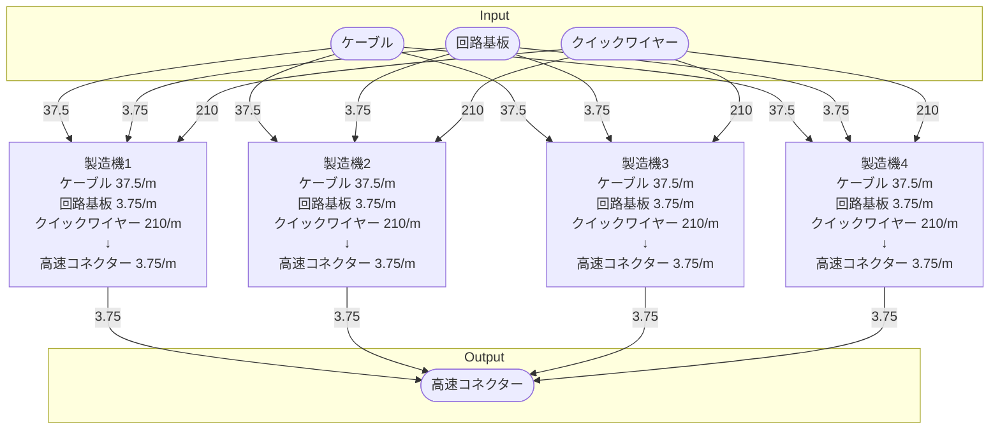

# 個別製造ライン設計書 高速コネクター製造ライン

## 概要
以下の物品を生産する

- 高速コネクター

## Input
- ケーブル 150.0/m
- 回路基板 15.0/m
- クイックワイヤー 840/m

## Output
- 高速コネクター 15.0/m

## 必要設備
- 製造機 4ケ
- ベルトコンベア類 適量

## 製造ライン

## 情報
書類テンプレートバージョン : 1.5.0
