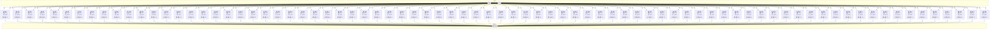

# 個別製造ライン設計書 強化鉄板製造ライン

## 概要
以下の物品を生産する

- 強化鉄板

## Input
- 鉄板 2400/m
- ネジ 4800/m

## Output
- 強化鉄板 400/m

## 必要設備
- 組立機 80ケ
- ベルトコンベア類 適量

## 製造ライン

```mermaid
flowchart TD

subgraph Input
    鉄板([鉄板])
    ネジ([ネジ])
end

組立機1[
    組立機1
    鉄板 30/m
    ネジ 60/m
    ↓
    強化鉄板 5/m
]

組立機2[
    組立機2
    鉄板 30/m
    ネジ 60/m
    ↓
    強化鉄板 5/m
]

組立機3[
    組立機3
    鉄板 30/m
    ネジ 60/m
    ↓
    強化鉄板 5/m
]

組立機4[
    組立機4
    鉄板 30/m
    ネジ 60/m
    ↓
    強化鉄板 5/m
]

組立機5[
    組立機5
    鉄板 30/m
    ネジ 60/m
    ↓
    強化鉄板 5/m
]

組立機6[
    組立機6
    鉄板 30/m
    ネジ 60/m
    ↓
    強化鉄板 5/m
]

組立機7[
    組立機7
    鉄板 30/m
    ネジ 60/m
    ↓
    強化鉄板 5/m
]

組立機8[
    組立機8
    鉄板 30/m
    ネジ 60/m
    ↓
    強化鉄板 5/m
]

組立機9[
    組立機9
    鉄板 30/m
    ネジ 60/m
    ↓
    強化鉄板 5/m
]

組立機10[
    組立機10
    鉄板 30/m
    ネジ 60/m
    ↓
    強化鉄板 5/m
]

組立機11[
    組立機11
    鉄板 30/m
    ネジ 60/m
    ↓
    強化鉄板 5/m
]

組立機12[
    組立機12
    鉄板 30/m
    ネジ 60/m
    ↓
    強化鉄板 5/m
]

組立機13[
    組立機13
    鉄板 30/m
    ネジ 60/m
    ↓
    強化鉄板 5/m
]

組立機14[
    組立機14
    鉄板 30/m
    ネジ 60/m
    ↓
    強化鉄板 5/m
]

組立機15[
    組立機15
    鉄板 30/m
    ネジ 60/m
    ↓
    強化鉄板 5/m
]

組立機16[
    組立機16
    鉄板 30/m
    ネジ 60/m
    ↓
    強化鉄板 5/m
]

組立機17[
    組立機17
    鉄板 30/m
    ネジ 60/m
    ↓
    強化鉄板 5/m
]

組立機18[
    組立機18
    鉄板 30/m
    ネジ 60/m
    ↓
    強化鉄板 5/m
]

組立機19[
    組立機19
    鉄板 30/m
    ネジ 60/m
    ↓
    強化鉄板 5/m
]

組立機20[
    組立機20
    鉄板 30/m
    ネジ 60/m
    ↓
    強化鉄板 5/m
]

組立機21[
    組立機21
    鉄板 30/m
    ネジ 60/m
    ↓
    強化鉄板 5/m
]

組立機22[
    組立機22
    鉄板 30/m
    ネジ 60/m
    ↓
    強化鉄板 5/m
]

組立機23[
    組立機23
    鉄板 30/m
    ネジ 60/m
    ↓
    強化鉄板 5/m
]

組立機24[
    組立機24
    鉄板 30/m
    ネジ 60/m
    ↓
    強化鉄板 5/m
]

組立機25[
    組立機25
    鉄板 30/m
    ネジ 60/m
    ↓
    強化鉄板 5/m
]

組立機26[
    組立機26
    鉄板 30/m
    ネジ 60/m
    ↓
    強化鉄板 5/m
]

組立機27[
    組立機27
    鉄板 30/m
    ネジ 60/m
    ↓
    強化鉄板 5/m
]

組立機28[
    組立機28
    鉄板 30/m
    ネジ 60/m
    ↓
    強化鉄板 5/m
]

組立機29[
    組立機29
    鉄板 30/m
    ネジ 60/m
    ↓
    強化鉄板 5/m
]

組立機30[
    組立機30
    鉄板 30/m
    ネジ 60/m
    ↓
    強化鉄板 5/m
]

組立機31[
    組立機31
    鉄板 30/m
    ネジ 60/m
    ↓
    強化鉄板 5/m
]

組立機32[
    組立機32
    鉄板 30/m
    ネジ 60/m
    ↓
    強化鉄板 5/m
]

組立機33[
    組立機33
    鉄板 30/m
    ネジ 60/m
    ↓
    強化鉄板 5/m
]

組立機34[
    組立機34
    鉄板 30/m
    ネジ 60/m
    ↓
    強化鉄板 5/m
]

組立機35[
    組立機35
    鉄板 30/m
    ネジ 60/m
    ↓
    強化鉄板 5/m
]

組立機36[
    組立機36
    鉄板 30/m
    ネジ 60/m
    ↓
    強化鉄板 5/m
]

組立機37[
    組立機37
    鉄板 30/m
    ネジ 60/m
    ↓
    強化鉄板 5/m
]

組立機38[
    組立機38
    鉄板 30/m
    ネジ 60/m
    ↓
    強化鉄板 5/m
]

組立機39[
    組立機39
    鉄板 30/m
    ネジ 60/m
    ↓
    強化鉄板 5/m
]

組立機40[
    組立機40
    鉄板 30/m
    ネジ 60/m
    ↓
    強化鉄板 5/m
]

組立機41[
    組立機41
    鉄板 30/m
    ネジ 60/m
    ↓
    強化鉄板 5/m
]

組立機42[
    組立機42
    鉄板 30/m
    ネジ 60/m
    ↓
    強化鉄板 5/m
]

組立機43[
    組立機43
    鉄板 30/m
    ネジ 60/m
    ↓
    強化鉄板 5/m
]

組立機44[
    組立機44
    鉄板 30/m
    ネジ 60/m
    ↓
    強化鉄板 5/m
]

組立機45[
    組立機45
    鉄板 30/m
    ネジ 60/m
    ↓
    強化鉄板 5/m
]

組立機46[
    組立機46
    鉄板 30/m
    ネジ 60/m
    ↓
    強化鉄板 5/m
]

組立機47[
    組立機47
    鉄板 30/m
    ネジ 60/m
    ↓
    強化鉄板 5/m
]

組立機48[
    組立機48
    鉄板 30/m
    ネジ 60/m
    ↓
    強化鉄板 5/m
]

組立機49[
    組立機49
    鉄板 30/m
    ネジ 60/m
    ↓
    強化鉄板 5/m
]

組立機50[
    組立機50
    鉄板 30/m
    ネジ 60/m
    ↓
    強化鉄板 5/m
]

組立機51[
    組立機51
    鉄板 30/m
    ネジ 60/m
    ↓
    強化鉄板 5/m
]

組立機52[
    組立機52
    鉄板 30/m
    ネジ 60/m
    ↓
    強化鉄板 5/m
]

組立機53[
    組立機53
    鉄板 30/m
    ネジ 60/m
    ↓
    強化鉄板 5/m
]

組立機54[
    組立機54
    鉄板 30/m
    ネジ 60/m
    ↓
    強化鉄板 5/m
]

組立機55[
    組立機55
    鉄板 30/m
    ネジ 60/m
    ↓
    強化鉄板 5/m
]

組立機56[
    組立機56
    鉄板 30/m
    ネジ 60/m
    ↓
    強化鉄板 5/m
]

組立機57[
    組立機57
    鉄板 30/m
    ネジ 60/m
    ↓
    強化鉄板 5/m
]

組立機58[
    組立機58
    鉄板 30/m
    ネジ 60/m
    ↓
    強化鉄板 5/m
]

組立機59[
    組立機59
    鉄板 30/m
    ネジ 60/m
    ↓
    強化鉄板 5/m
]

組立機60[
    組立機60
    鉄板 30/m
    ネジ 60/m
    ↓
    強化鉄板 5/m
]

組立機61[
    組立機61
    鉄板 30/m
    ネジ 60/m
    ↓
    強化鉄板 5/m
]

組立機62[
    組立機62
    鉄板 30/m
    ネジ 60/m
    ↓
    強化鉄板 5/m
]

組立機63[
    組立機63
    鉄板 30/m
    ネジ 60/m
    ↓
    強化鉄板 5/m
]

組立機64[
    組立機64
    鉄板 30/m
    ネジ 60/m
    ↓
    強化鉄板 5/m
]

組立機65[
    組立機65
    鉄板 30/m
    ネジ 60/m
    ↓
    強化鉄板 5/m
]

組立機66[
    組立機66
    鉄板 30/m
    ネジ 60/m
    ↓
    強化鉄板 5/m
]

組立機67[
    組立機67
    鉄板 30/m
    ネジ 60/m
    ↓
    強化鉄板 5/m
]

組立機68[
    組立機68
    鉄板 30/m
    ネジ 60/m
    ↓
    強化鉄板 5/m
]

組立機69[
    組立機69
    鉄板 30/m
    ネジ 60/m
    ↓
    強化鉄板 5/m
]

組立機70[
    組立機70
    鉄板 30/m
    ネジ 60/m
    ↓
    強化鉄板 5/m
]

組立機71[
    組立機71
    鉄板 30/m
    ネジ 60/m
    ↓
    強化鉄板 5/m
]

組立機72[
    組立機72
    鉄板 30/m
    ネジ 60/m
    ↓
    強化鉄板 5/m
]

組立機73[
    組立機73
    鉄板 30/m
    ネジ 60/m
    ↓
    強化鉄板 5/m
]

組立機74[
    組立機74
    鉄板 30/m
    ネジ 60/m
    ↓
    強化鉄板 5/m
]

組立機75[
    組立機75
    鉄板 30/m
    ネジ 60/m
    ↓
    強化鉄板 5/m
]

組立機76[
    組立機76
    鉄板 30/m
    ネジ 60/m
    ↓
    強化鉄板 5/m
]

組立機77[
    組立機77
    鉄板 30/m
    ネジ 60/m
    ↓
    強化鉄板 5/m
]

組立機78[
    組立機78
    鉄板 30/m
    ネジ 60/m
    ↓
    強化鉄板 5/m
]

組立機79[
    組立機79
    鉄板 30/m
    ネジ 60/m
    ↓
    強化鉄板 5/m
]

組立機80[
    組立機80
    鉄板 30/m
    ネジ 60/m
    ↓
    強化鉄板 5/m
]

subgraph Output
    強化鉄板([強化鉄板])
end

鉄板-->|30|組立機1
ネジ-->|60|組立機1
組立機1-->|5|強化鉄板
鉄板-->|30|組立機2
ネジ-->|60|組立機2
組立機2-->|5|強化鉄板
鉄板-->|30|組立機3
ネジ-->|60|組立機3
組立機3-->|5|強化鉄板
鉄板-->|30|組立機4
ネジ-->|60|組立機4
組立機4-->|5|強化鉄板
鉄板-->|30|組立機5
ネジ-->|60|組立機5
組立機5-->|5|強化鉄板
鉄板-->|30|組立機6
ネジ-->|60|組立機6
組立機6-->|5|強化鉄板
鉄板-->|30|組立機7
ネジ-->|60|組立機7
組立機7-->|5|強化鉄板
鉄板-->|30|組立機8
ネジ-->|60|組立機8
組立機8-->|5|強化鉄板
鉄板-->|30|組立機9
ネジ-->|60|組立機9
組立機9-->|5|強化鉄板
鉄板-->|30|組立機10
ネジ-->|60|組立機10
組立機10-->|5|強化鉄板
鉄板-->|30|組立機11
ネジ-->|60|組立機11
組立機11-->|5|強化鉄板
鉄板-->|30|組立機12
ネジ-->|60|組立機12
組立機12-->|5|強化鉄板
鉄板-->|30|組立機13
ネジ-->|60|組立機13
組立機13-->|5|強化鉄板
鉄板-->|30|組立機14
ネジ-->|60|組立機14
組立機14-->|5|強化鉄板
鉄板-->|30|組立機15
ネジ-->|60|組立機15
組立機15-->|5|強化鉄板
鉄板-->|30|組立機16
ネジ-->|60|組立機16
組立機16-->|5|強化鉄板
鉄板-->|30|組立機17
ネジ-->|60|組立機17
組立機17-->|5|強化鉄板
鉄板-->|30|組立機18
ネジ-->|60|組立機18
組立機18-->|5|強化鉄板
鉄板-->|30|組立機19
ネジ-->|60|組立機19
組立機19-->|5|強化鉄板
鉄板-->|30|組立機20
ネジ-->|60|組立機20
組立機20-->|5|強化鉄板
鉄板-->|30|組立機21
ネジ-->|60|組立機21
組立機21-->|5|強化鉄板
鉄板-->|30|組立機22
ネジ-->|60|組立機22
組立機22-->|5|強化鉄板
鉄板-->|30|組立機23
ネジ-->|60|組立機23
組立機23-->|5|強化鉄板
鉄板-->|30|組立機24
ネジ-->|60|組立機24
組立機24-->|5|強化鉄板
鉄板-->|30|組立機25
ネジ-->|60|組立機25
組立機25-->|5|強化鉄板
鉄板-->|30|組立機26
ネジ-->|60|組立機26
組立機26-->|5|強化鉄板
鉄板-->|30|組立機27
ネジ-->|60|組立機27
組立機27-->|5|強化鉄板
鉄板-->|30|組立機28
ネジ-->|60|組立機28
組立機28-->|5|強化鉄板
鉄板-->|30|組立機29
ネジ-->|60|組立機29
組立機29-->|5|強化鉄板
鉄板-->|30|組立機30
ネジ-->|60|組立機30
組立機30-->|5|強化鉄板
鉄板-->|30|組立機31
ネジ-->|60|組立機31
組立機31-->|5|強化鉄板
鉄板-->|30|組立機32
ネジ-->|60|組立機32
組立機32-->|5|強化鉄板
鉄板-->|30|組立機33
ネジ-->|60|組立機33
組立機33-->|5|強化鉄板
鉄板-->|30|組立機34
ネジ-->|60|組立機34
組立機34-->|5|強化鉄板
鉄板-->|30|組立機35
ネジ-->|60|組立機35
組立機35-->|5|強化鉄板
鉄板-->|30|組立機36
ネジ-->|60|組立機36
組立機36-->|5|強化鉄板
鉄板-->|30|組立機37
ネジ-->|60|組立機37
組立機37-->|5|強化鉄板
鉄板-->|30|組立機38
ネジ-->|60|組立機38
組立機38-->|5|強化鉄板
鉄板-->|30|組立機39
ネジ-->|60|組立機39
組立機39-->|5|強化鉄板
鉄板-->|30|組立機40
ネジ-->|60|組立機40
組立機40-->|5|強化鉄板
鉄板-->|30|組立機41
ネジ-->|60|組立機41
組立機41-->|5|強化鉄板
鉄板-->|30|組立機42
ネジ-->|60|組立機42
組立機42-->|5|強化鉄板
鉄板-->|30|組立機43
ネジ-->|60|組立機43
組立機43-->|5|強化鉄板
鉄板-->|30|組立機44
ネジ-->|60|組立機44
組立機44-->|5|強化鉄板
鉄板-->|30|組立機45
ネジ-->|60|組立機45
組立機45-->|5|強化鉄板
鉄板-->|30|組立機46
ネジ-->|60|組立機46
組立機46-->|5|強化鉄板
鉄板-->|30|組立機47
ネジ-->|60|組立機47
組立機47-->|5|強化鉄板
鉄板-->|30|組立機48
ネジ-->|60|組立機48
組立機48-->|5|強化鉄板
鉄板-->|30|組立機49
ネジ-->|60|組立機49
組立機49-->|5|強化鉄板
鉄板-->|30|組立機50
ネジ-->|60|組立機50
組立機50-->|5|強化鉄板
鉄板-->|30|組立機51
ネジ-->|60|組立機51
組立機51-->|5|強化鉄板
鉄板-->|30|組立機52
ネジ-->|60|組立機52
組立機52-->|5|強化鉄板
鉄板-->|30|組立機53
ネジ-->|60|組立機53
組立機53-->|5|強化鉄板
鉄板-->|30|組立機54
ネジ-->|60|組立機54
組立機54-->|5|強化鉄板
鉄板-->|30|組立機55
ネジ-->|60|組立機55
組立機55-->|5|強化鉄板
鉄板-->|30|組立機56
ネジ-->|60|組立機56
組立機56-->|5|強化鉄板
鉄板-->|30|組立機57
ネジ-->|60|組立機57
組立機57-->|5|強化鉄板
鉄板-->|30|組立機58
ネジ-->|60|組立機58
組立機58-->|5|強化鉄板
鉄板-->|30|組立機59
ネジ-->|60|組立機59
組立機59-->|5|強化鉄板
鉄板-->|30|組立機60
ネジ-->|60|組立機60
組立機60-->|5|強化鉄板
鉄板-->|30|組立機61
ネジ-->|60|組立機61
組立機61-->|5|強化鉄板
鉄板-->|30|組立機62
ネジ-->|60|組立機62
組立機62-->|5|強化鉄板
鉄板-->|30|組立機63
ネジ-->|60|組立機63
組立機63-->|5|強化鉄板
鉄板-->|30|組立機64
ネジ-->|60|組立機64
組立機64-->|5|強化鉄板
鉄板-->|30|組立機65
ネジ-->|60|組立機65
組立機65-->|5|強化鉄板
鉄板-->|30|組立機66
ネジ-->|60|組立機66
組立機66-->|5|強化鉄板
鉄板-->|30|組立機67
ネジ-->|60|組立機67
組立機67-->|5|強化鉄板
鉄板-->|30|組立機68
ネジ-->|60|組立機68
組立機68-->|5|強化鉄板
鉄板-->|30|組立機69
ネジ-->|60|組立機69
組立機69-->|5|強化鉄板
鉄板-->|30|組立機70
ネジ-->|60|組立機70
組立機70-->|5|強化鉄板
鉄板-->|30|組立機71
ネジ-->|60|組立機71
組立機71-->|5|強化鉄板
鉄板-->|30|組立機72
ネジ-->|60|組立機72
組立機72-->|5|強化鉄板
鉄板-->|30|組立機73
ネジ-->|60|組立機73
組立機73-->|5|強化鉄板
鉄板-->|30|組立機74
ネジ-->|60|組立機74
組立機74-->|5|強化鉄板
鉄板-->|30|組立機75
ネジ-->|60|組立機75
組立機75-->|5|強化鉄板
鉄板-->|30|組立機76
ネジ-->|60|組立機76
組立機76-->|5|強化鉄板
鉄板-->|30|組立機77
ネジ-->|60|組立機77
組立機77-->|5|強化鉄板
鉄板-->|30|組立機78
ネジ-->|60|組立機78
組立機78-->|5|強化鉄板
鉄板-->|30|組立機79
ネジ-->|60|組立機79
組立機79-->|5|強化鉄板
鉄板-->|30|組立機80
ネジ-->|60|組立機80
組立機80-->|5|強化鉄板
```

## 情報
書類テンプレートバージョン : 1.5.0
