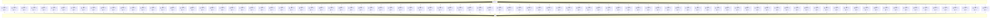

# 個別製造ライン設計書 鉄板製造ライン

## 概要
以下の物品を生産する

- 鉄板

## Input
- 鉄のインゴット 3000/m

## Output
- 鉄板 2000/m

## 必要設備
- 製作機 100ケ
- ベルトコンベア類 適量

## 製造ライン

```mermaid
flowchart TD

subgraph Input
    鉄のインゴット([鉄のインゴット])
end

製作機1[
    製作機1
    鉄のインゴット 30/m
    ↓
    鉄板 20/m
]

製作機2[
    製作機2
    鉄のインゴット 30/m
    ↓
    鉄板 20/m
]

製作機3[
    製作機3
    鉄のインゴット 30/m
    ↓
    鉄板 20/m
]

製作機4[
    製作機4
    鉄のインゴット 30/m
    ↓
    鉄板 20/m
]

製作機5[
    製作機5
    鉄のインゴット 30/m
    ↓
    鉄板 20/m
]

製作機6[
    製作機6
    鉄のインゴット 30/m
    ↓
    鉄板 20/m
]

製作機7[
    製作機7
    鉄のインゴット 30/m
    ↓
    鉄板 20/m
]

製作機8[
    製作機8
    鉄のインゴット 30/m
    ↓
    鉄板 20/m
]

製作機9[
    製作機9
    鉄のインゴット 30/m
    ↓
    鉄板 20/m
]

製作機10[
    製作機10
    鉄のインゴット 30/m
    ↓
    鉄板 20/m
]

製作機11[
    製作機11
    鉄のインゴット 30/m
    ↓
    鉄板 20/m
]

製作機12[
    製作機12
    鉄のインゴット 30/m
    ↓
    鉄板 20/m
]

製作機13[
    製作機13
    鉄のインゴット 30/m
    ↓
    鉄板 20/m
]

製作機14[
    製作機14
    鉄のインゴット 30/m
    ↓
    鉄板 20/m
]

製作機15[
    製作機15
    鉄のインゴット 30/m
    ↓
    鉄板 20/m
]

製作機16[
    製作機16
    鉄のインゴット 30/m
    ↓
    鉄板 20/m
]

製作機17[
    製作機17
    鉄のインゴット 30/m
    ↓
    鉄板 20/m
]

製作機18[
    製作機18
    鉄のインゴット 30/m
    ↓
    鉄板 20/m
]

製作機19[
    製作機19
    鉄のインゴット 30/m
    ↓
    鉄板 20/m
]

製作機20[
    製作機20
    鉄のインゴット 30/m
    ↓
    鉄板 20/m
]

製作機21[
    製作機21
    鉄のインゴット 30/m
    ↓
    鉄板 20/m
]

製作機22[
    製作機22
    鉄のインゴット 30/m
    ↓
    鉄板 20/m
]

製作機23[
    製作機23
    鉄のインゴット 30/m
    ↓
    鉄板 20/m
]

製作機24[
    製作機24
    鉄のインゴット 30/m
    ↓
    鉄板 20/m
]

製作機25[
    製作機25
    鉄のインゴット 30/m
    ↓
    鉄板 20/m
]

製作機26[
    製作機26
    鉄のインゴット 30/m
    ↓
    鉄板 20/m
]

製作機27[
    製作機27
    鉄のインゴット 30/m
    ↓
    鉄板 20/m
]

製作機28[
    製作機28
    鉄のインゴット 30/m
    ↓
    鉄板 20/m
]

製作機29[
    製作機29
    鉄のインゴット 30/m
    ↓
    鉄板 20/m
]

製作機30[
    製作機30
    鉄のインゴット 30/m
    ↓
    鉄板 20/m
]

製作機31[
    製作機31
    鉄のインゴット 30/m
    ↓
    鉄板 20/m
]

製作機32[
    製作機32
    鉄のインゴット 30/m
    ↓
    鉄板 20/m
]

製作機33[
    製作機33
    鉄のインゴット 30/m
    ↓
    鉄板 20/m
]

製作機34[
    製作機34
    鉄のインゴット 30/m
    ↓
    鉄板 20/m
]

製作機35[
    製作機35
    鉄のインゴット 30/m
    ↓
    鉄板 20/m
]

製作機36[
    製作機36
    鉄のインゴット 30/m
    ↓
    鉄板 20/m
]

製作機37[
    製作機37
    鉄のインゴット 30/m
    ↓
    鉄板 20/m
]

製作機38[
    製作機38
    鉄のインゴット 30/m
    ↓
    鉄板 20/m
]

製作機39[
    製作機39
    鉄のインゴット 30/m
    ↓
    鉄板 20/m
]

製作機40[
    製作機40
    鉄のインゴット 30/m
    ↓
    鉄板 20/m
]

製作機41[
    製作機41
    鉄のインゴット 30/m
    ↓
    鉄板 20/m
]

製作機42[
    製作機42
    鉄のインゴット 30/m
    ↓
    鉄板 20/m
]

製作機43[
    製作機43
    鉄のインゴット 30/m
    ↓
    鉄板 20/m
]

製作機44[
    製作機44
    鉄のインゴット 30/m
    ↓
    鉄板 20/m
]

製作機45[
    製作機45
    鉄のインゴット 30/m
    ↓
    鉄板 20/m
]

製作機46[
    製作機46
    鉄のインゴット 30/m
    ↓
    鉄板 20/m
]

製作機47[
    製作機47
    鉄のインゴット 30/m
    ↓
    鉄板 20/m
]

製作機48[
    製作機48
    鉄のインゴット 30/m
    ↓
    鉄板 20/m
]

製作機49[
    製作機49
    鉄のインゴット 30/m
    ↓
    鉄板 20/m
]

製作機50[
    製作機50
    鉄のインゴット 30/m
    ↓
    鉄板 20/m
]

製作機51[
    製作機51
    鉄のインゴット 30/m
    ↓
    鉄板 20/m
]

製作機52[
    製作機52
    鉄のインゴット 30/m
    ↓
    鉄板 20/m
]

製作機53[
    製作機53
    鉄のインゴット 30/m
    ↓
    鉄板 20/m
]

製作機54[
    製作機54
    鉄のインゴット 30/m
    ↓
    鉄板 20/m
]

製作機55[
    製作機55
    鉄のインゴット 30/m
    ↓
    鉄板 20/m
]

製作機56[
    製作機56
    鉄のインゴット 30/m
    ↓
    鉄板 20/m
]

製作機57[
    製作機57
    鉄のインゴット 30/m
    ↓
    鉄板 20/m
]

製作機58[
    製作機58
    鉄のインゴット 30/m
    ↓
    鉄板 20/m
]

製作機59[
    製作機59
    鉄のインゴット 30/m
    ↓
    鉄板 20/m
]

製作機60[
    製作機60
    鉄のインゴット 30/m
    ↓
    鉄板 20/m
]

製作機61[
    製作機61
    鉄のインゴット 30/m
    ↓
    鉄板 20/m
]

製作機62[
    製作機62
    鉄のインゴット 30/m
    ↓
    鉄板 20/m
]

製作機63[
    製作機63
    鉄のインゴット 30/m
    ↓
    鉄板 20/m
]

製作機64[
    製作機64
    鉄のインゴット 30/m
    ↓
    鉄板 20/m
]

製作機65[
    製作機65
    鉄のインゴット 30/m
    ↓
    鉄板 20/m
]

製作機66[
    製作機66
    鉄のインゴット 30/m
    ↓
    鉄板 20/m
]

製作機67[
    製作機67
    鉄のインゴット 30/m
    ↓
    鉄板 20/m
]

製作機68[
    製作機68
    鉄のインゴット 30/m
    ↓
    鉄板 20/m
]

製作機69[
    製作機69
    鉄のインゴット 30/m
    ↓
    鉄板 20/m
]

製作機70[
    製作機70
    鉄のインゴット 30/m
    ↓
    鉄板 20/m
]

製作機71[
    製作機71
    鉄のインゴット 30/m
    ↓
    鉄板 20/m
]

製作機72[
    製作機72
    鉄のインゴット 30/m
    ↓
    鉄板 20/m
]

製作機73[
    製作機73
    鉄のインゴット 30/m
    ↓
    鉄板 20/m
]

製作機74[
    製作機74
    鉄のインゴット 30/m
    ↓
    鉄板 20/m
]

製作機75[
    製作機75
    鉄のインゴット 30/m
    ↓
    鉄板 20/m
]

製作機76[
    製作機76
    鉄のインゴット 30/m
    ↓
    鉄板 20/m
]

製作機77[
    製作機77
    鉄のインゴット 30/m
    ↓
    鉄板 20/m
]

製作機78[
    製作機78
    鉄のインゴット 30/m
    ↓
    鉄板 20/m
]

製作機79[
    製作機79
    鉄のインゴット 30/m
    ↓
    鉄板 20/m
]

製作機80[
    製作機80
    鉄のインゴット 30/m
    ↓
    鉄板 20/m
]

製作機81[
    製作機81
    鉄のインゴット 30/m
    ↓
    鉄板 20/m
]

製作機82[
    製作機82
    鉄のインゴット 30/m
    ↓
    鉄板 20/m
]

製作機83[
    製作機83
    鉄のインゴット 30/m
    ↓
    鉄板 20/m
]

製作機84[
    製作機84
    鉄のインゴット 30/m
    ↓
    鉄板 20/m
]

製作機85[
    製作機85
    鉄のインゴット 30/m
    ↓
    鉄板 20/m
]

製作機86[
    製作機86
    鉄のインゴット 30/m
    ↓
    鉄板 20/m
]

製作機87[
    製作機87
    鉄のインゴット 30/m
    ↓
    鉄板 20/m
]

製作機88[
    製作機88
    鉄のインゴット 30/m
    ↓
    鉄板 20/m
]

製作機89[
    製作機89
    鉄のインゴット 30/m
    ↓
    鉄板 20/m
]

製作機90[
    製作機90
    鉄のインゴット 30/m
    ↓
    鉄板 20/m
]

製作機91[
    製作機91
    鉄のインゴット 30/m
    ↓
    鉄板 20/m
]

製作機92[
    製作機92
    鉄のインゴット 30/m
    ↓
    鉄板 20/m
]

製作機93[
    製作機93
    鉄のインゴット 30/m
    ↓
    鉄板 20/m
]

製作機94[
    製作機94
    鉄のインゴット 30/m
    ↓
    鉄板 20/m
]

製作機95[
    製作機95
    鉄のインゴット 30/m
    ↓
    鉄板 20/m
]

製作機96[
    製作機96
    鉄のインゴット 30/m
    ↓
    鉄板 20/m
]

製作機97[
    製作機97
    鉄のインゴット 30/m
    ↓
    鉄板 20/m
]

製作機98[
    製作機98
    鉄のインゴット 30/m
    ↓
    鉄板 20/m
]

製作機99[
    製作機99
    鉄のインゴット 30/m
    ↓
    鉄板 20/m
]

製作機100[
    製作機100
    鉄のインゴット 30/m
    ↓
    鉄板 20/m
]

subgraph Output
    鉄板([鉄板])
end

鉄のインゴット-->|30|製作機1
製作機1-->|20|鉄板
鉄のインゴット-->|30|製作機2
製作機2-->|20|鉄板
鉄のインゴット-->|30|製作機3
製作機3-->|20|鉄板
鉄のインゴット-->|30|製作機4
製作機4-->|20|鉄板
鉄のインゴット-->|30|製作機5
製作機5-->|20|鉄板
鉄のインゴット-->|30|製作機6
製作機6-->|20|鉄板
鉄のインゴット-->|30|製作機7
製作機7-->|20|鉄板
鉄のインゴット-->|30|製作機8
製作機8-->|20|鉄板
鉄のインゴット-->|30|製作機9
製作機9-->|20|鉄板
鉄のインゴット-->|30|製作機10
製作機10-->|20|鉄板
鉄のインゴット-->|30|製作機11
製作機11-->|20|鉄板
鉄のインゴット-->|30|製作機12
製作機12-->|20|鉄板
鉄のインゴット-->|30|製作機13
製作機13-->|20|鉄板
鉄のインゴット-->|30|製作機14
製作機14-->|20|鉄板
鉄のインゴット-->|30|製作機15
製作機15-->|20|鉄板
鉄のインゴット-->|30|製作機16
製作機16-->|20|鉄板
鉄のインゴット-->|30|製作機17
製作機17-->|20|鉄板
鉄のインゴット-->|30|製作機18
製作機18-->|20|鉄板
鉄のインゴット-->|30|製作機19
製作機19-->|20|鉄板
鉄のインゴット-->|30|製作機20
製作機20-->|20|鉄板
鉄のインゴット-->|30|製作機21
製作機21-->|20|鉄板
鉄のインゴット-->|30|製作機22
製作機22-->|20|鉄板
鉄のインゴット-->|30|製作機23
製作機23-->|20|鉄板
鉄のインゴット-->|30|製作機24
製作機24-->|20|鉄板
鉄のインゴット-->|30|製作機25
製作機25-->|20|鉄板
鉄のインゴット-->|30|製作機26
製作機26-->|20|鉄板
鉄のインゴット-->|30|製作機27
製作機27-->|20|鉄板
鉄のインゴット-->|30|製作機28
製作機28-->|20|鉄板
鉄のインゴット-->|30|製作機29
製作機29-->|20|鉄板
鉄のインゴット-->|30|製作機30
製作機30-->|20|鉄板
鉄のインゴット-->|30|製作機31
製作機31-->|20|鉄板
鉄のインゴット-->|30|製作機32
製作機32-->|20|鉄板
鉄のインゴット-->|30|製作機33
製作機33-->|20|鉄板
鉄のインゴット-->|30|製作機34
製作機34-->|20|鉄板
鉄のインゴット-->|30|製作機35
製作機35-->|20|鉄板
鉄のインゴット-->|30|製作機36
製作機36-->|20|鉄板
鉄のインゴット-->|30|製作機37
製作機37-->|20|鉄板
鉄のインゴット-->|30|製作機38
製作機38-->|20|鉄板
鉄のインゴット-->|30|製作機39
製作機39-->|20|鉄板
鉄のインゴット-->|30|製作機40
製作機40-->|20|鉄板
鉄のインゴット-->|30|製作機41
製作機41-->|20|鉄板
鉄のインゴット-->|30|製作機42
製作機42-->|20|鉄板
鉄のインゴット-->|30|製作機43
製作機43-->|20|鉄板
鉄のインゴット-->|30|製作機44
製作機44-->|20|鉄板
鉄のインゴット-->|30|製作機45
製作機45-->|20|鉄板
鉄のインゴット-->|30|製作機46
製作機46-->|20|鉄板
鉄のインゴット-->|30|製作機47
製作機47-->|20|鉄板
鉄のインゴット-->|30|製作機48
製作機48-->|20|鉄板
鉄のインゴット-->|30|製作機49
製作機49-->|20|鉄板
鉄のインゴット-->|30|製作機50
製作機50-->|20|鉄板
鉄のインゴット-->|30|製作機51
製作機51-->|20|鉄板
鉄のインゴット-->|30|製作機52
製作機52-->|20|鉄板
鉄のインゴット-->|30|製作機53
製作機53-->|20|鉄板
鉄のインゴット-->|30|製作機54
製作機54-->|20|鉄板
鉄のインゴット-->|30|製作機55
製作機55-->|20|鉄板
鉄のインゴット-->|30|製作機56
製作機56-->|20|鉄板
鉄のインゴット-->|30|製作機57
製作機57-->|20|鉄板
鉄のインゴット-->|30|製作機58
製作機58-->|20|鉄板
鉄のインゴット-->|30|製作機59
製作機59-->|20|鉄板
鉄のインゴット-->|30|製作機60
製作機60-->|20|鉄板
鉄のインゴット-->|30|製作機61
製作機61-->|20|鉄板
鉄のインゴット-->|30|製作機62
製作機62-->|20|鉄板
鉄のインゴット-->|30|製作機63
製作機63-->|20|鉄板
鉄のインゴット-->|30|製作機64
製作機64-->|20|鉄板
鉄のインゴット-->|30|製作機65
製作機65-->|20|鉄板
鉄のインゴット-->|30|製作機66
製作機66-->|20|鉄板
鉄のインゴット-->|30|製作機67
製作機67-->|20|鉄板
鉄のインゴット-->|30|製作機68
製作機68-->|20|鉄板
鉄のインゴット-->|30|製作機69
製作機69-->|20|鉄板
鉄のインゴット-->|30|製作機70
製作機70-->|20|鉄板
鉄のインゴット-->|30|製作機71
製作機71-->|20|鉄板
鉄のインゴット-->|30|製作機72
製作機72-->|20|鉄板
鉄のインゴット-->|30|製作機73
製作機73-->|20|鉄板
鉄のインゴット-->|30|製作機74
製作機74-->|20|鉄板
鉄のインゴット-->|30|製作機75
製作機75-->|20|鉄板
鉄のインゴット-->|30|製作機76
製作機76-->|20|鉄板
鉄のインゴット-->|30|製作機77
製作機77-->|20|鉄板
鉄のインゴット-->|30|製作機78
製作機78-->|20|鉄板
鉄のインゴット-->|30|製作機79
製作機79-->|20|鉄板
鉄のインゴット-->|30|製作機80
製作機80-->|20|鉄板
鉄のインゴット-->|30|製作機81
製作機81-->|20|鉄板
鉄のインゴット-->|30|製作機82
製作機82-->|20|鉄板
鉄のインゴット-->|30|製作機83
製作機83-->|20|鉄板
鉄のインゴット-->|30|製作機84
製作機84-->|20|鉄板
鉄のインゴット-->|30|製作機85
製作機85-->|20|鉄板
鉄のインゴット-->|30|製作機86
製作機86-->|20|鉄板
鉄のインゴット-->|30|製作機87
製作機87-->|20|鉄板
鉄のインゴット-->|30|製作機88
製作機88-->|20|鉄板
鉄のインゴット-->|30|製作機89
製作機89-->|20|鉄板
鉄のインゴット-->|30|製作機90
製作機90-->|20|鉄板
鉄のインゴット-->|30|製作機91
製作機91-->|20|鉄板
鉄のインゴット-->|30|製作機92
製作機92-->|20|鉄板
鉄のインゴット-->|30|製作機93
製作機93-->|20|鉄板
鉄のインゴット-->|30|製作機94
製作機94-->|20|鉄板
鉄のインゴット-->|30|製作機95
製作機95-->|20|鉄板
鉄のインゴット-->|30|製作機96
製作機96-->|20|鉄板
鉄のインゴット-->|30|製作機97
製作機97-->|20|鉄板
鉄のインゴット-->|30|製作機98
製作機98-->|20|鉄板
鉄のインゴット-->|30|製作機99
製作機99-->|20|鉄板
鉄のインゴット-->|30|製作機100
製作機100-->|20|鉄板
```

## 情報
書類テンプレートバージョン : 1.5.0
