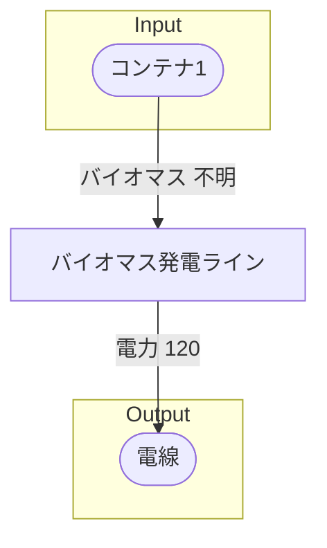

# (工場名) 全体製造ライン設計書

## 使用レシピ
### バイオマス発電
|Input|Output|
|---|---|
|バイオマス 不明/m|電力 30Mw|

## 必要製造ライン
### バイオマス発電ライン
|レシピ名|数|Input計|Output計|
|---|---|---|---|
|バイオマス発電|4|バイオマス 不明/m|電力 120Mw|

## 製造ラインフローチャート

## 情報
書類テンプレートバージョン : 1.7.0
