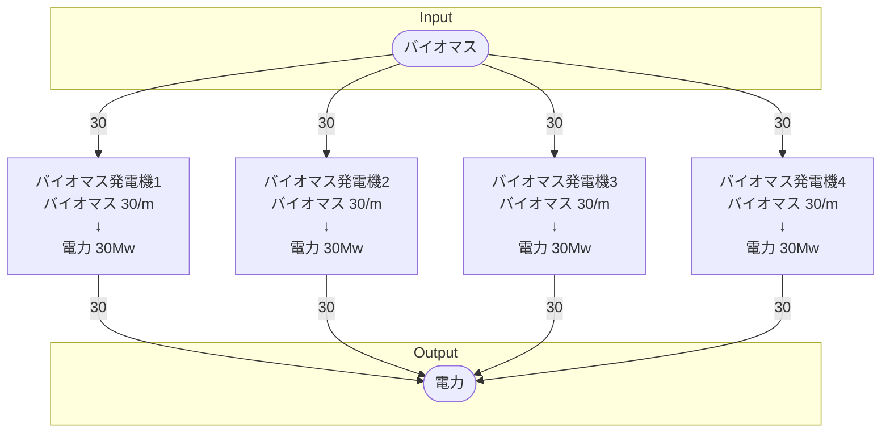

# 個別製造ライン設計書 電力製造ライン

## 概要
バイオマスから電力を発電するライン

## Input
- バイオマス 不明/m

## Output
- 電力 120Mw

## 必要設備
- バイオマス発電機 4ケ
- ベルトコンベア類 適量

## 製造ライン

```mermaid
flowchart TD

subgraph Input
    バイオマス([バイオマス])
end

バイオマス発電機1[
    バイオマス発電機1
    バイオマス 30/m
    ↓
    電力 30Mw
]

バイオマス発電機2[
    バイオマス発電機2
    バイオマス 30/m
    ↓
    電力 30Mw
]

バイオマス発電機3[
    バイオマス発電機3
    バイオマス 30/m
    ↓
    電力 30Mw
]

バイオマス発電機4[
    バイオマス発電機4
    バイオマス 30/m
    ↓
    電力 30Mw
]

subgraph Output
    電力([電力])
end

バイオマス-->|30|バイオマス発電機1
バイオマス発電機1-->|30|電力
バイオマス-->|30|バイオマス発電機2
バイオマス発電機2-->|30|電力
バイオマス-->|30|バイオマス発電機3
バイオマス発電機3-->|30|電力
バイオマス-->|30|バイオマス発電機4
バイオマス発電機4-->|30|電力
```

## 情報
書類テンプレートバージョン : 1.5.0
