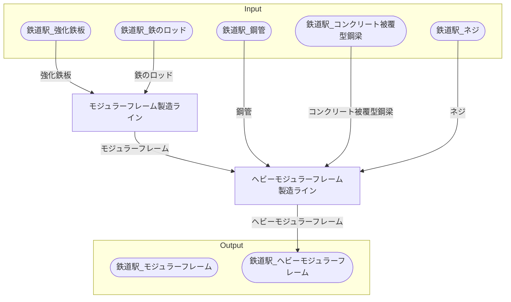

# マルセイユモジュラーフレーム工場 全体製造ライン設計書

## 使用レシピ
### モジュラーフレーム
|I/O|物品名|要求数|
|---|---|---|
|input|鉄のロッド|12|
|input|強化鉄板|3|
|---|---|---|
|output|モジュラーフレーム|2|
### ヘビーモジュラーフレーム
|I/O|物品名|要求数|
|---|---|---|
|input|モジュラーフレーム|10|
|input|鋼管|20|
|input|コンクリート被覆型鋼梁|10|
|input|ネジ|240|
|---|---|---|
|output|ヘビーモジュラーフレーム|2|

## 必要製造ライン
### モジュラーフレーム製造ライン

レシピ名 : モジュラーフレーム  
レシピ数 : 32

|I/O|物品名|要求数|
|---|---|---|
|input|鉄のロッド|384|
|input|強化鉄板|96|
|---|---|---|
|output|モジュラーフレーム|64|

### ヘビーモジュラーフレーム製造ライン

レシピ名 : ヘビーモジュラーフレーム  
レシピ数 : 16

|I/O|物品名|要求数|
|---|---|---|
|input|モジュラーフレーム|160|
|input|鋼管|320|
|input|コンクリート被覆型鋼梁|160|
|input|ネジ|3840|
|---|---|---|
|output|ヘビーモジュラーフレーム|32|

## 製造ラインフローチャート

## 情報
書類テンプレートバージョン : 1.7.0
