# 個別製造ライン設計書 ヘビーモジュラーフレーム製造ライン

## 概要
以下の物品を生産する

- ヘビーモジュラーフレーム

## Input
- モジュラーフレーム 160/m
- 鋼管 320/m
- コンクリート被覆型鋼梁 160/m
- ネジ 3840/m

## Output
- ヘビーモジュラーフレーム 32/m

## 必要設備
- 製造機 16ケ
- ベルトコンベア類 適量

## 製造ライン

```mermaid
flowchart TD

subgraph Input
    モジュラーフレーム([モジュラーフレーム])
    鋼管([鋼管])
    コンクリート被覆型鋼梁([コンクリート被覆型鋼梁])
    ネジ([ネジ])
end

製造機1[
    製造機1
    モジュラーフレーム 10/m
    鋼管 20/m
    コンクリート被覆型鋼梁 10/m
    ネジ 240/m
    ↓
    ヘビーモジュラーフレーム 2/m
]

製造機2[
    製造機2
    モジュラーフレーム 10/m
    鋼管 20/m
    コンクリート被覆型鋼梁 10/m
    ネジ 240/m
    ↓
    ヘビーモジュラーフレーム 2/m
]

製造機3[
    製造機3
    モジュラーフレーム 10/m
    鋼管 20/m
    コンクリート被覆型鋼梁 10/m
    ネジ 240/m
    ↓
    ヘビーモジュラーフレーム 2/m
]

製造機4[
    製造機4
    モジュラーフレーム 10/m
    鋼管 20/m
    コンクリート被覆型鋼梁 10/m
    ネジ 240/m
    ↓
    ヘビーモジュラーフレーム 2/m
]

製造機5[
    製造機5
    モジュラーフレーム 10/m
    鋼管 20/m
    コンクリート被覆型鋼梁 10/m
    ネジ 240/m
    ↓
    ヘビーモジュラーフレーム 2/m
]

製造機6[
    製造機6
    モジュラーフレーム 10/m
    鋼管 20/m
    コンクリート被覆型鋼梁 10/m
    ネジ 240/m
    ↓
    ヘビーモジュラーフレーム 2/m
]

製造機7[
    製造機7
    モジュラーフレーム 10/m
    鋼管 20/m
    コンクリート被覆型鋼梁 10/m
    ネジ 240/m
    ↓
    ヘビーモジュラーフレーム 2/m
]

製造機8[
    製造機8
    モジュラーフレーム 10/m
    鋼管 20/m
    コンクリート被覆型鋼梁 10/m
    ネジ 240/m
    ↓
    ヘビーモジュラーフレーム 2/m
]

製造機9[
    製造機9
    モジュラーフレーム 10/m
    鋼管 20/m
    コンクリート被覆型鋼梁 10/m
    ネジ 240/m
    ↓
    ヘビーモジュラーフレーム 2/m
]

製造機10[
    製造機10
    モジュラーフレーム 10/m
    鋼管 20/m
    コンクリート被覆型鋼梁 10/m
    ネジ 240/m
    ↓
    ヘビーモジュラーフレーム 2/m
]

製造機11[
    製造機11
    モジュラーフレーム 10/m
    鋼管 20/m
    コンクリート被覆型鋼梁 10/m
    ネジ 240/m
    ↓
    ヘビーモジュラーフレーム 2/m
]

製造機12[
    製造機12
    モジュラーフレーム 10/m
    鋼管 20/m
    コンクリート被覆型鋼梁 10/m
    ネジ 240/m
    ↓
    ヘビーモジュラーフレーム 2/m
]

製造機13[
    製造機13
    モジュラーフレーム 10/m
    鋼管 20/m
    コンクリート被覆型鋼梁 10/m
    ネジ 240/m
    ↓
    ヘビーモジュラーフレーム 2/m
]

製造機14[
    製造機14
    モジュラーフレーム 10/m
    鋼管 20/m
    コンクリート被覆型鋼梁 10/m
    ネジ 240/m
    ↓
    ヘビーモジュラーフレーム 2/m
]

製造機15[
    製造機15
    モジュラーフレーム 10/m
    鋼管 20/m
    コンクリート被覆型鋼梁 10/m
    ネジ 240/m
    ↓
    ヘビーモジュラーフレーム 2/m
]

製造機16[
    製造機16
    モジュラーフレーム 10/m
    鋼管 20/m
    コンクリート被覆型鋼梁 10/m
    ネジ 240/m
    ↓
    ヘビーモジュラーフレーム 2/m
]

subgraph Output
    ヘビーモジュラーフレーム([ヘビーモジュラーフレーム])
end

モジュラーフレーム-->|10|製造機1
鋼管-->|20|製造機1
コンクリート被覆型鋼梁-->|10|製造機1
ネジ-->|240|製造機1
製造機1-->|2|ヘビーモジュラーフレーム
モジュラーフレーム-->|10|製造機2
鋼管-->|20|製造機2
コンクリート被覆型鋼梁-->|10|製造機2
ネジ-->|240|製造機2
製造機2-->|2|ヘビーモジュラーフレーム
モジュラーフレーム-->|10|製造機3
鋼管-->|20|製造機3
コンクリート被覆型鋼梁-->|10|製造機3
ネジ-->|240|製造機3
製造機3-->|2|ヘビーモジュラーフレーム
モジュラーフレーム-->|10|製造機4
鋼管-->|20|製造機4
コンクリート被覆型鋼梁-->|10|製造機4
ネジ-->|240|製造機4
製造機4-->|2|ヘビーモジュラーフレーム
モジュラーフレーム-->|10|製造機5
鋼管-->|20|製造機5
コンクリート被覆型鋼梁-->|10|製造機5
ネジ-->|240|製造機5
製造機5-->|2|ヘビーモジュラーフレーム
モジュラーフレーム-->|10|製造機6
鋼管-->|20|製造機6
コンクリート被覆型鋼梁-->|10|製造機6
ネジ-->|240|製造機6
製造機6-->|2|ヘビーモジュラーフレーム
モジュラーフレーム-->|10|製造機7
鋼管-->|20|製造機7
コンクリート被覆型鋼梁-->|10|製造機7
ネジ-->|240|製造機7
製造機7-->|2|ヘビーモジュラーフレーム
モジュラーフレーム-->|10|製造機8
鋼管-->|20|製造機8
コンクリート被覆型鋼梁-->|10|製造機8
ネジ-->|240|製造機8
製造機8-->|2|ヘビーモジュラーフレーム
モジュラーフレーム-->|10|製造機9
鋼管-->|20|製造機9
コンクリート被覆型鋼梁-->|10|製造機9
ネジ-->|240|製造機9
製造機9-->|2|ヘビーモジュラーフレーム
モジュラーフレーム-->|10|製造機10
鋼管-->|20|製造機10
コンクリート被覆型鋼梁-->|10|製造機10
ネジ-->|240|製造機10
製造機10-->|2|ヘビーモジュラーフレーム
モジュラーフレーム-->|10|製造機11
鋼管-->|20|製造機11
コンクリート被覆型鋼梁-->|10|製造機11
ネジ-->|240|製造機11
製造機11-->|2|ヘビーモジュラーフレーム
モジュラーフレーム-->|10|製造機12
鋼管-->|20|製造機12
コンクリート被覆型鋼梁-->|10|製造機12
ネジ-->|240|製造機12
製造機12-->|2|ヘビーモジュラーフレーム
モジュラーフレーム-->|10|製造機13
鋼管-->|20|製造機13
コンクリート被覆型鋼梁-->|10|製造機13
ネジ-->|240|製造機13
製造機13-->|2|ヘビーモジュラーフレーム
モジュラーフレーム-->|10|製造機14
鋼管-->|20|製造機14
コンクリート被覆型鋼梁-->|10|製造機14
ネジ-->|240|製造機14
製造機14-->|2|ヘビーモジュラーフレーム
モジュラーフレーム-->|10|製造機15
鋼管-->|20|製造機15
コンクリート被覆型鋼梁-->|10|製造機15
ネジ-->|240|製造機15
製造機15-->|2|ヘビーモジュラーフレーム
モジュラーフレーム-->|10|製造機16
鋼管-->|20|製造機16
コンクリート被覆型鋼梁-->|10|製造機16
ネジ-->|240|製造機16
製造機16-->|2|ヘビーモジュラーフレーム
```

## 情報
書類テンプレートバージョン : 1.5.0
